[Chapter Two](Contents.xhtml#krch2)

[LESSON 2: WHY TEACH FINANCIAL LITERACY?](Contents.xhtml#krch2)

_**It’s not how much money you make. It’s how much money you keep.**_

In 1990, Mike took over his father’s empire and is, in fact, doing a better job than his dad did. We see each other once or twice a year on the golf course. He and his wife are wealthier than you could imagine. Rich dad’s empire is in great hands, and Mike is now grooming his son to take his place, as his dad had groomed us.

In 1994, I retired at the age of 47, and my wife Kim was 37. Retirement does not mean not working. For us, it means that, barring unforeseen cataclysmic changes, we can work or not work, and our wealth grows automatically, staying ahead of inflation. Our assets are large enough to grow by themselves. It’s like planting a tree. You water it for years, and then one day it doesn’t need you anymore. Its roots are implanted deep enough. Then the tree provides shade for your enjoyment.

Mike chose to run the empire, and I chose to retire.

Whenever I speak to groups of people, they often ask what I would recommend that they do. “How do I get started?” “Is there a book you would recommend?” “What should I do to prepare my children?” “What is your secret to success?” “How do I make millions?”

Whenever I hear one of these questions, I’m reminded of the following story:

* * *

**The Richest Businessmen**

In 1923 a group of our greatest leaders and richest businessmen held a meeting at the Edgewater Beach hotel in Chicago. Among them were Charles Schwab, head of the largest independent steel company; Samuel Insull, president of the world’s largest utility; Howard Hopson, head of the largest gas company; Ivar Kreuger, president of International Match Co., one of the world’s largest companies at that time; Leon Frazier, president of the Bank of International Settlements; Richard Whitney, president of the New York Stock Exchange; Arthur Cotton and Jesse Livermore, two of the biggest stock speculators; and Albert Fall, a member of President Harding’s cabinet. Twenty-five years later, nine of these titans ended their lives as follows: Schwab died penniless after living for five years on borrowed money. Insull died broke in a foreign land, and Kreuger and Cotton also died broke. Hopson went insane. Whitney and Albert Fall were released from prison, and Fraser and Livermore committed suicide.

* * *

I doubt if anyone can say what really happened to these men. If you look at the date, 1923, it was just before the 1929 market crash and the Great Depression, which I suspect had a great impact on these men and their lives. The point is this: Today we live in times of greater and faster change than these men did. I suspect there will be many booms and busts in the coming years that will parallel the ups and downs these men faced. I am concerned that too many people are too focused on money and not on their greatest wealth, their education. If people are prepared to be flexible, keep an open mind and learn, they will grow richer and richer despite tough changes. If they think money will solve problems, they will have a rough ride. Intelligence solves problems and produces money. Money without financial intelligence is money soon gone.

Most people fail to realize that in life, it’s not how much money you make. It’s how much money you keep. We’ve all heard stories of lottery winners who are poor, then suddenly rich, and then poor again. They win millions, yet are soon back where they started. Or stories of professional athletes, who at the age of 24 are earning millions, but are sleeping under a bridge 10 years later.

I remember a story of a young basketball player who a year ago had millions. Today, at just 29, he claims his friends, attorney, and accountant took his money, and he was forced to work at a car wash for minimum wage. He was fired from the car wash because he refused to take off his championship ring as he was wiping off the cars. His story made national news and he is appealing his termination, claiming hardship and discrimination. He claims that the ring is all he has left and if it was stripped away, he’ll crumble.

I know so many people who became instant millionaires. And while I am glad some people have become richer and richer, I caution them that in the long run, it’s not how much money you make. It’s how much you keep, and how many generations you keep it.

So when people ask, “Where do I get started?” or “Tell me how to get rich quick,” they often are greatly disappointed with my answer. I simply say to them what my rich dad said to me when I was a little kid. “If you want to be rich, you need to be financially literate.”

That idea was drummed into my head every time we were together. As I said, my educated dad stressed the importance of reading books, while my rich dad stressed the need to master financial literacy.

If you are going to build the Empire State Building, the first thing you need to do is dig a deep hole and pour a strong foundation. If you are going to build a home in the suburbs, all you need to do is pour a six-inch slab of concrete. Most people, in their drive to get rich, are trying to build an Empire State Building on a six-inch slab.

Our school system, created in the Agrarian Age, still believes in homes with no foundation. Dirt floors are still the rage. So kids graduate from school with virtually no financial foundation. One day, sleepless and deep in debt in suburbia, living the American Dream, they decide that the answer to their financial problems is to find a way to get rich quick.

Construction on the skyscraper begins. It goes up quickly, and soon, instead of the Empire State Building, we have the Leaning Tower of Suburbia. The sleepless nights return.

As for Mike and me in our adult years, both of our choices were possible because we were taught to pour a strong financial foundation when we were just kids.

Accounting is possibly the most confusing, boring subject in the world, but if you want to be rich long-term, it could be the most important subject. For rich dad, the question was how to take a boring and confusing subject and teach it to kids. The answer he found was to make it simple by teaching it in pictures.

My rich dad poured a strong financial foundation for Mike and me. Since we were just kids, he created a simple way to teach us.

For years he only drew pictures and used few words. Mike and I understood the simple drawings, the jargon, the movement of money, and then in later years, rich dad began adding numbers. Today, Mike has gone on to master much more complex and sophisticated accounting analysis because he had to in order to run his empire. I am not as sophisticated because my empire is smaller, yet we come from the same simple foundation. Over the following pages, I offer to you the same simple line drawings Mike’s dad created for us. Though basic, those drawings helped guide two little boys in building great sums of wealth on a solid and deep foundation.

_**Rich people acquire assets. The poor and middle class acquire liabilities that they think are assets.**_

_**Rule #1: You must know the difference between an asset and a liability, and buy assets.**_

If you want to be rich, this is all you need to know. It is rule number one. It is the only rule. This may sound absurdly simple, but most people have no idea how profound this rule is. Most people struggle financially because they do not know the difference between an asset and a liability.

“Rich people acquire assets. The poor and middle class acquire liabilities that they think are assets,” said rich dad.

When rich dad explained this to Mike and me, we thought he was kidding. Here we were, nearly teenagers and waiting for the secret to getting rich, and this was his answer. It was so simple that we stopped for a long time to think about it.

“What is an asset?” asked Mike.

“Don’t worry right now,” said rich dad. “Just let the idea sink in. If you can comprehend the simplicity, your life will have a plan and be financially easy. It is simple. That is why the idea is missed.”

“You mean all we need to know is what an asset is, acquire them, and we’ll be rich?” I asked.

Rich dad nodded his head. “It’s that simple.”

“If it’s that simple, how come everyone is not rich?” I asked. Rich dad smiled. “Because people do not know the difference between an asset and a liability.”

I remember asking, “How could adults be so misguided? If it is that simple, if it is that important, why would everyone not want to find out?”

It took rich dad only a few minutes to explain what assets and liabilities were.

As an adult, I have difficulty explaining it to other adults. The simplicity of the idea escapes them because they have been educated differently. They were taught by other educated professionals, such as bankers, accountants, real estate agents, financial planners, and so forth. The difficulty comes in asking adults to unlearn, or become children again. An intelligent adult often feels it is demeaning to pay attention to simplistic definitions.

Rich dad believed in the KISS principle—Keep It Simple, Stupid (or Keep It Super Simple)—so he kept it simple for us, and that made our financial foundation strong.

So what causes the confusion? How could something so simple be so screwed up? Why would someone buy an asset that was really a liability? The answer is found in basic education.

We focus on the word “literacy” and not “financial literacy.” What defines something to be an asset or a liability are not words. In fact, if you really want to be confused, look up the words “asset” and “liability” in the dictionary. I know the definition may sound good to a trained accountant, but for the average person, it makes no sense. But we adults are often too proud to admit that something does not make sense.

_**An asset puts money in my pocket. A liability takes money out of my pocket.**_

To us young boys, rich dad said, “What defines an asset are not words, but numbers. And if you can’t read the numbers, you can’t tell an asset from a hole in the ground.” “In accounting,” rich dad would say, “it’s not the numbers, but what the numbers are telling you. It’s just like words. It’s not the words, but the story the words are telling you.”

“If you want to be rich, you’ve got to read and understand numbers.” If I heard that once, I heard it a thousand times from my rich dad. And I also heard, “The rich acquire assets, and the poor and middle class acquire liabilities.”

Here is how to tell the difference between an asset and a liability. Most accountants and financial professionals do not agree with the definitions, but these simple drawings were the start of strong financial foundations for two young boys.

_**This is the cash-flow pattern of an asset:**_

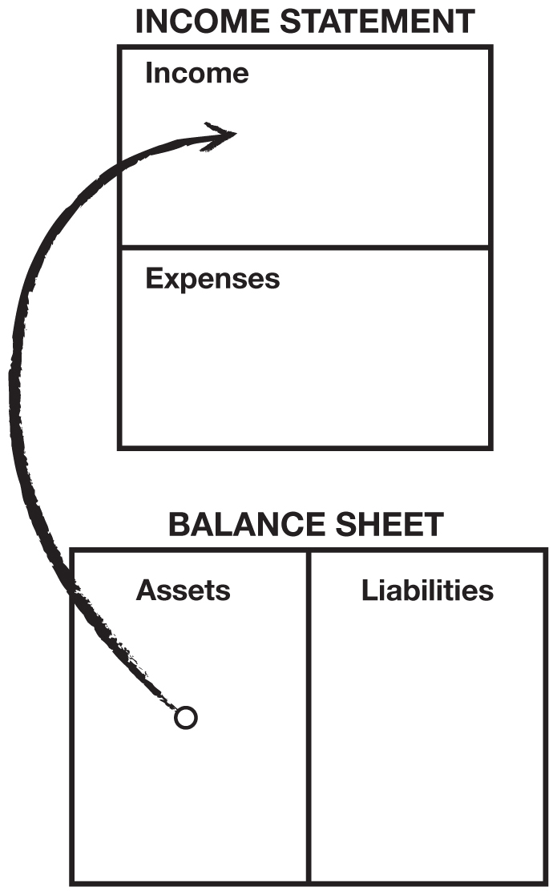

The top part of the diagram is an Income Statement, often called a Profit-and-Loss Statement. It measures income and expenses: money in and money out. The lower part of the diagram is a Balance Sheet. It’s called that because it’s supposed to balance assets against liabilities. Many financial novices do not know the relationship between the Income Statement and the Balance Sheet, and it is vital to understand that relationship.

So as I said earlier, my rich dad simply told two young boys that “assets put money in your pocket.” Nice, simple, and usable.

_**This is the cash-flow pattern of a liability:**_

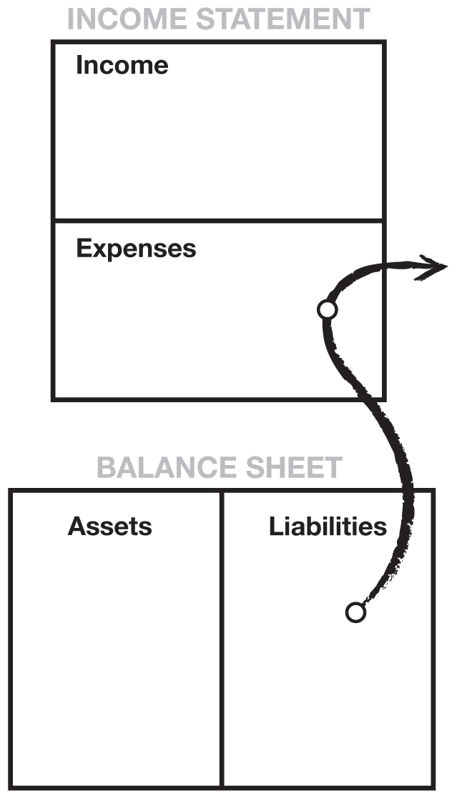

Now that assets and liabilities have been defined through pictures, it may be easier to understand my definitions in words. An asset is something that puts money in my pocket. A liability is something that takes money out of my pocket. This is really all you need to know. If you want to be rich, simply spend your life buying assets. If you want to be poor or middle class, spend your life buying liabilities.

Illiteracy, both in words and numbers, is the foundation of financial struggle. If people are having difficulties financially, there is something that they don’t understand, either in words or numbers. The rich are rich because they are more literate in different areas than people who struggle financially. So if you want to be rich and maintain your wealth, it’s important to be financially literate, in words as well as numbers.

The arrows in the diagrams represent the flow of cash, or “cash flow.” Numbers alone mean little, just as words out of context mean little. It’s the story that counts. In financial reporting, reading numbers is looking for the plot, the story of where the cash is flowing. In 80 percent of most families, the financial story paints a picture of hard work to get ahead. However, this effort is for naught because they spend their lives buying liabilities instead of assets.

_**This is the cash-flow pattern of a poor person:**_

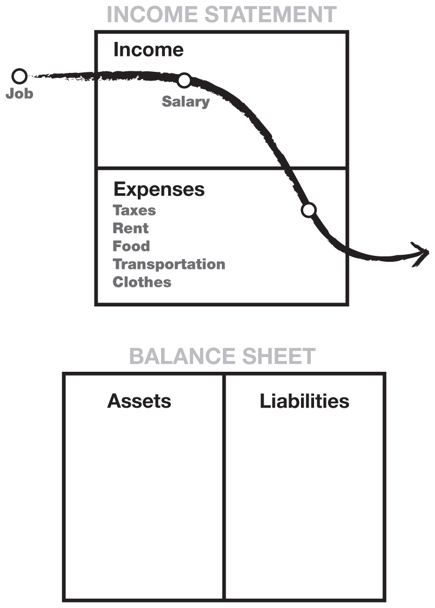

_**This is the cash-flow pattern of a person in the middle class:**_

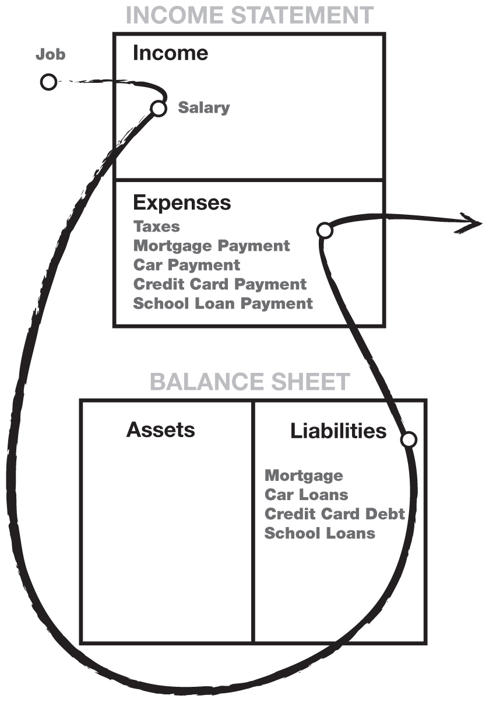

_**This is the cash-flow pattern of a rich person:**_

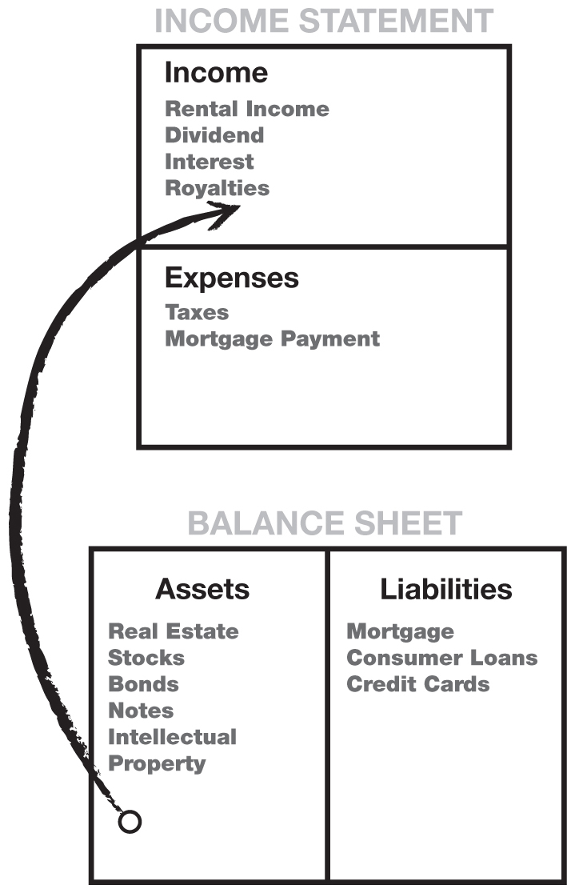

All of these diagrams are obviously oversimplified. Everyone has living expenses, the need for food, shelter, and clothing. The diagrams show the flow of cash through a poor, middle-class, and wealthy person’s life. It is the cash flow that tells the story of how a person handles their money.

The reason I started with the story of the richest men in America is to illustrate the flaw in believing that money will solve all problems. That is why I cringe whenever I hear people ask me how to get rich quicker, or where they should start. I often hear, “I’m in debt, so I need to make more money.”

But more money will often not solve the problem. In fact, it may compound the problem. Money often makes obvious our tragic human flaws, putting a spotlight on what we don’t know. That is why, all too often, a person who comes into a sudden windfall of cash—let’s say an inheritance, a pay raise, or lottery winnings—soon returns to the same financial mess, if not worse, than the mess they were in before. Money only accentuates the cash-flow pattern running in your head. If your pattern is to spend everything you get, most likely an increase in cash will just result in an increase in spending. Thus, the saying, “A fool and his money is one big party.”

_**Cash flow tells the story of how a person handles money.**_

I have said many times that we go to school to gain scholastic and professional skills, both of which are important. We learn to make money with our professional skills. In the 1960s when I was in high school, if someone did well academically, people assumed this bright student would go on to be a medical doctor because it was the profession with the promise of the greatest financial reward.

Today, doctors face financial challenges I wouldn’t wish on my worst enemy: insurance companies taking control of the business, managed health care, government intervention, and malpractice suits. Today, kids want to be famous athletes, movie stars, rock stars, beauty queens, or CEOs because that is where the fame, money, and prestige are. That is the reason it is so hard to motivate kids in school today. They know that professional success is no longer solely linked to academic success, as it once was.

Because students leave school without financial skills, millions of educated people pursue their profession successfully, but later find themselves struggling financially. They work harder but don’t get ahead. What is missing from their education is not how to make money, but how to manage money. It’s called financial aptitude—what you do with the money once you make it, how to keep people from taking it from you, how to keep it longer, and how to make that money work hard for you. Most people don’t understand why they struggle financially because they don’t understand cash flow. A person can be highly educated, professionally successful, and financially illiterate. These people often work harder than they need to because they learned how to work hard, but not how to have their money work hard for them.

_**How the Quest for a Financial Dream Turns into a Financial Nightmare**_

The classic story of hardworking people has a set pattern. Recently married, the happy, highly educated young couple moves into one of their cramped rented apartments. Immediately, they realize that they are saving money because two can live as cheaply as one.

The problem is the apartment is cramped. They decide to save money to buy their dream home so they can have kids. They now have two incomes, and they begin to focus on their careers. Their incomes begin to increase.

As their incomes go up, their expenses go up as well.

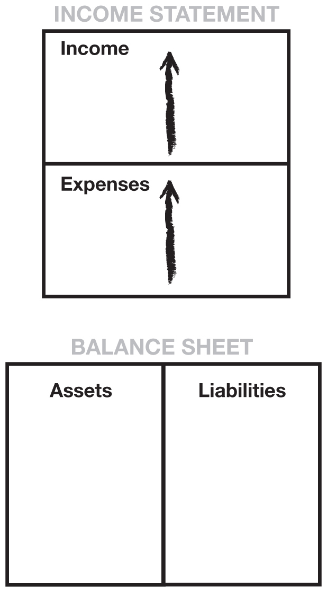

The number-one expense for most people is taxes. Many people think it’s income tax, but for most Americans, their highest tax is Social Security. As an employee, it appears as if the Social Security tax combined with the Medicare tax rate is roughly 7.5 percent, but it’s really 15 percent since the employer must match the Social Security amount. In essence, it is money the employer can’t pay you. On top of that, you still have to pay income tax on the amount deducted from your wages for Social Security tax, income you never received because it went directly to Social Security through withholding.

Going back to the young couple, as a result of their incomes increasing, they decide to buy the house of their dreams. Once in their house, they have a new tax, called property tax. Then they buy a new car, new furniture, and new appliances to match their new house. All of a sudden, they wake up and their liabilities column is full of mortgage and credit-card debt. Their liabilities go up.

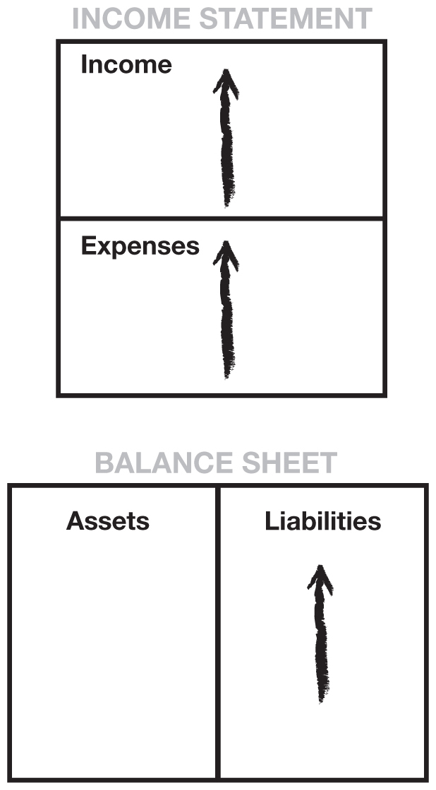

They’re now trapped in the Rat Race. Pretty soon a baby comes along and they work harder. The process repeats itself: Higher incomes cause higher taxes, also called “bracket creep.” A credit card comes in the mail. They use it and max it out. A loan company calls and says their greatest “asset,” their home, has appreciated in value. Because their credit is so good, the company offers a bill-consolidation loan and tells them the intelligent thing to do is clear off the high-interest consumer debt by paying off their credit card. And besides, interest on their home is a tax deduction. They go for it, and pay off those high-interest credit cards. They breathe a sigh of relief. Their credit cards are paid off. They’ve now folded their consumer debt into their home mortgage. Their payments go down because they extend their debt over 30 years. It is the smart thing to do.

Their neighbor calls to invite them to go shopping. The Memorial Day sale is on. They promise themselves they’ll just window shop, but they take a credit card, just in case.

I run into this young couple all the time. Their names change, but their financial dilemma is the same. They come to one of my talks to hear what I have to say. They ask me, “Can you tell us how to make more money?”

They don’t understand that their trouble is really how they choose to spend the money they do have. It is caused by financial illiteracy and not understanding the difference between an asset and a liability.

More money seldom solves someone’s money problems. Intelligence solves problems. There is a saying a friend of mine says over and over to people in debt: “If you find you have dug yourself into a hole… stop digging.”

As a child, my dad often told us that the Japanese were aware of three powers: the power of the sword, the jewel, and the mirror.

The sword symbolizes the power of weapons. America has spent trillions of dollars on weapons and, because of this, is a powerful military presence in the world.

The jewel symbolizes the power of money. There is some degree of truth to the saying, “Remember the golden rule. He who has the gold makes the rules.”

The mirror symbolizes the power of self-knowledge. This self-knowledge, according to Japanese legend, was the most treasured of the three.

All too often, the poor and middle class allow the power of money to control them. By simply getting up and working harder, failing to ask themselves if what they do makes sense, they shoot themselves in the foot as they leave for work every morning. By not fully understanding money, the vast majority of people allow its awesome power to control them.

If they used the power of the mirror, they would have asked themselves, “Does this make sense?” All too often, instead of trusting their inner wisdom, that genius inside, most people follow the crowd. They do things because everybody else does them. They conform, rather than question. Often, they mindlessly repeat what they have been told: “Diversify.” “Your home is an asset.” “Your home is your biggest investment.” “You get a tax break for going into greater debt.” “Get a safe job.” “Don’t make mistakes.” “Don’t take risks.”

It is said that the fear of public speaking is a fear greater than death for most people. According to psychiatrists, the fear of public speaking is caused by the fear of ostracism, the fear of standing out, the fear of criticism, the fear of ridicule, and the fear of being an outcast. The fear of being different prevents most people from seeking new ways to solve their problems.

That is why my educated dad said the Japanese valued the power of the mirror the most, for it is only when we look into it that we find truth. Fear is the main reason that people say, “Play it safe.” That goes for anything, be it sports, relationships, careers, or money.

_**A person can be highly educated, professionally successful, and financially illiterate.**_

It is that same fear, the fear of ostracism, that causes people to conform to, and not question, commonly accepted opinions or popular trends: “Your home is an asset.” “Get a bill-consolidation loan, and get out of debt.” “Work harder.” “It’s a promotion.” “Someday I’ll be a vice president.” “Save money.” “When I get a raise, I’ll buy us a bigger house.” “Mutual funds are safe.”

Many financial problems are caused by trying to keep up with the Joneses. Occasionally, we all need to look in the mirror and be true to our inner wisdom rather than our fears.

By the time Mike and I were 16 years old, we began to have problems in school. We were not bad kids. We just began to separate from the crowd. We worked for Mike’s dad after school and on weekends. Mike and I often spent hours after work just sitting at a table with his dad while he held meetings with his bankers, attorneys, accountants, brokers, investors, managers, and employees. Here was a man who had left school at 13 who was now directing, instructing, ordering, and asking questions of educated people. They came at his beck and call, and cringed when he didn’t approve of them.

Here was a man who had not gone along with the crowd. He was a man who did his own thinking and detested the words, “We have to do it this way because that’s the way everyone else does it.” He also hated the word “can’t.” If you wanted him to do something, just say, “I don’t think you can do it.”

Mike and I learned more sitting in on his meetings than we did in all our years of school, college included. Mike’s dad was not book-smart, but he was financially educated and successful as a result. He told us over and over again, “An intelligent person hires people who are more intelligent than he is.” So Mike and I had the benefit of spending hours listening to and learning from intelligent people.

But because of this, Mike and I couldn’t go along with the standard dogma our teachers preached, and that caused problems. Whenever the teacher said, “If you don’t get good grades, you won’t do well in the real world,” Mike and I just raised our eyebrows. When we were told to follow set procedures and not deviate from the rules, we could see how school discouraged creativity. We started to understand why our rich dad told us that schools were designed to produce good employees, instead of employers. Occasionally, Mike or I would ask our teachers how what we studied was applicable in the real world, or why we never studied money and how it worked. To the latter question, we often got the answer that money was not important, that if we excelled in our education, the money would follow. The more we knew about the power of money, the more distant we grew from the teachers and our classmates.

My highly educated dad never pressured me about my grades, but we did begin to argue about money. By the time I was 16, I probably had a far better foundation with money than both my parents. I could keep books, I listened to tax accountants, corporate attorneys, bankers, real estate brokers, investors, and so forth. By contrast, my dad talked to other teachers.

One day my dad told me that our home was his greatest investment. A not-too-pleasant argument took place when I showed him why I thought a house was not a good investment.

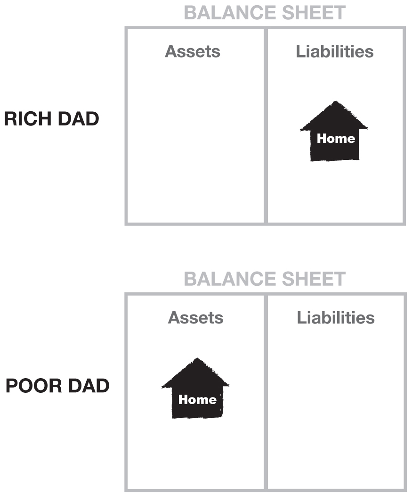

The above diagram illustrates the difference in perception between my rich dad and my poor dad when it came to their homes. One dad thought his house was an asset, and the other dad thought it was a liability. I remember when I drew the following diagram for my dad showing him the direction of cash flow. I also showed him the ancillary expenses that went along with owning the home. A bigger home meant bigger expenses, and the cash flow kept going out through the expense column.

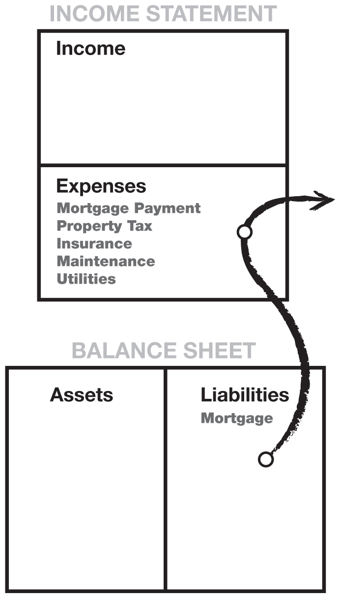

Today, people still challenge me on the idea of a house not being an asset. I know that for many people, it is their dream as well as their largest investment. And owning your own home is better than nothing. I simply offer an alternate way of looking at this popular dogma. If my wife and I were to buy a bigger, flashier house, we realize it wouldn’t be an asset. It would be a liability since it would take money out of our pocket.

So here is the argument I put forth. I really don’t expect most people to agree with it because your home is an emotional thing and when it comes to money, high emotions tend to lower financial intelligence. I know from personal experience that money has a way of making every decision emotional.

* * *

• When it comes to houses, most people work all their lives paying for a home they never own. In other words, most people buy a new house every few years, each time incurring a new 30-year loan to pay off the previous one.

• Even though people receive a tax deduction for interest on mortgage payments, they pay for all their other expenses with after-tax dollars, even after they pay off their mortgage.

• My wife’s parents were shocked when the property taxes on their home increased to $1,000 a month. This was after they had retired, so the increase put a strain on their retirement budget, and they felt forced to move.

• Houses do not always go up in value. I have friends who owe a million dollars for a home that today would sell for far less.

• The greatest losses of all are those from missed opportunities. If all your money is tied up in your house, you may be forced to work harder because your money continues blowing out of the expense column, instead of adding to the asset column—the classic middle-class cash-flow pattern. If a young couple would put more money into their asset column early on, their later years would be easier. Their assets would have grown and would be available to help cover expenses. All too often, a house only serves as a vehicle for incurring a home-equity loan to pay for mounting expenses.

* * *

In summary, the end result in making a decision to own a house that is too expensive in lieu of starting an investment portfolio impacts an individual in at least the following three ways:

* * *

 _1. Loss of time_, during which other assets could have grown in value.

 _2. Loss of additional capital_, which could have been invested instead of paying for high-maintenance expenses related directly to the home.

 _3. Loss of education_. Too often, people count their house and savings and retirement plans as all they have in their asset column. Because they have no money to invest, they simply don’t invest. This costs them investment experience. Most never become what the investment world calls “a sophisticated investor.” And the best investments are usually first sold to sophisticated investors, who then turn around and sell them to the people playing it safe.

* * *

I am not saying don’t buy a house. What I am saying is that you should understand the difference between an asset and a liability. When I want a bigger house, I first buy assets that will generate the cash flow to pay for the house.

My educated dad’s personal financial statement best demonstrates the life of someone caught in the Rat Race. His expenses match his income, never allowing him enough left over to invest in assets. As a result, his liabilities are larger than his assets.

The following diagram on the left shows my poor dad’s income statement. It is worth a thousand words. It shows that his income and expenses are equal while his liabilities are larger than his assets.

My rich dad’s personal financial statement on the right reflects the results of a life dedicated to investing and minimizing liabilities.

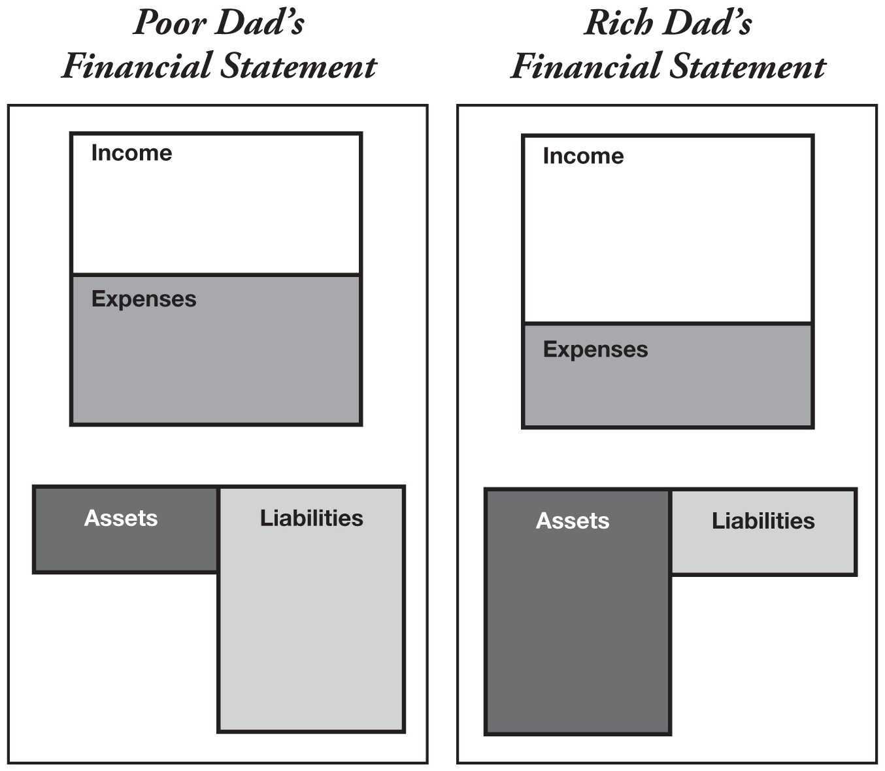

_**Why the Rich Get Richer**_

A review of my rich dad’s financial statement shows why the rich get richer. The asset column generates more than enough income to cover expenses, with the balance reinvested into the asset column. The asset column continues to grow and, therefore, the income it produces grows with it. The result is that the rich get richer!

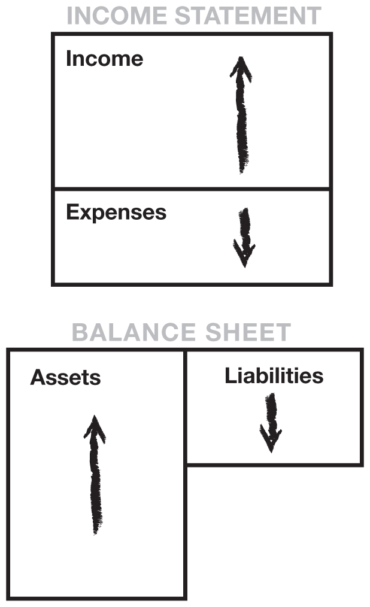

_**Why the Middle Class Struggle**_

The middle class finds itself in a constant state of financial struggle. Their primary income is through their salary. As their wages increase, so do their taxes. Their expenses tend to increase in proportion to their salary increase: hence, the phrase “the Rat Race.” They treat their home as their primary asset, instead of investing in income-producing assets.

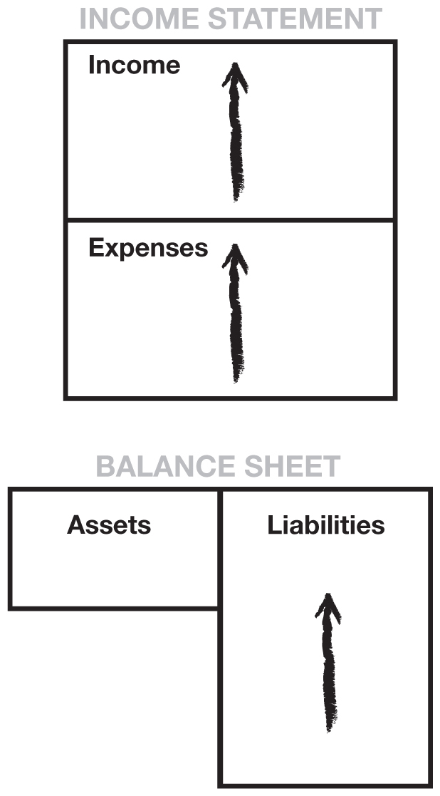

This pattern of treating your home as an investment, and the philosophy that a pay raise means you can buy a larger home or spend more, is the foundation of today’s debt-ridden society. Increased spending throws families into greater debt and into more financial uncertainty, even though they may be advancing in their jobs and receiving raises on a regular basis. This is high-risk living caused by weak financial education.

The massive loss of jobs in recent times proves how shaky the middle class really is financially. Company pension plans are being replaced by 401(k) plans. Social Security is obviously in trouble and can’t be relied upon as a source for retirement. Panic has set in for the middle class.

Today, mutual funds are popular because they supposedly represent safety. Average mutual-fund buyers are too busy working to pay taxes and mortgages, save for their children’s college, and pay off credit cards. They do not have time to study investing, so they rely on the expertise of the manager of a mutual fund. Also, because the mutual fund includes many different types of investments, they feel their money is safer because it is “diversified.” This educated middle class subscribes to the dogma put out by mutual-fund brokers and financial planners: “Play it safe. Avoid risk.”

The real tragedy is that the lack of early financial education is what creates the risk faced by average middle-class people. The reason they have to play it safe is because their financial positions are tenuous at best. Their balance sheets are not balanced. Instead, they are loaded with liabilities and have no real assets that generate income. Typically, their only source of income is their paycheck. Their livelihood becomes entirely dependent on their employer. So when genuine “deals of a lifetime” come along, these people can’t take advantage of them because they are working so hard, are taxed to the max, and are loaded with debt.

As I said at the start of this section, the most important rule is to know the difference between an asset and a liability. Once you understand the difference, concentrate your efforts on buying income-generating assets. That’s the best way to get started on a path to becoming rich. Keep doing that, and your asset column will grow. Keep liabilities and expenses down so more money is available to continue pouring into the asset column. Soon the asset base will be so deep that you can afford to look at more speculative investments: investments that may have returns of 100 percent to infinity; $5,000 investments that are soon turned into $1 million or more; investments that the middle class calls “too risky.” The investment is not risky for the financially literate.

If you do what the masses do, you get the following picture:

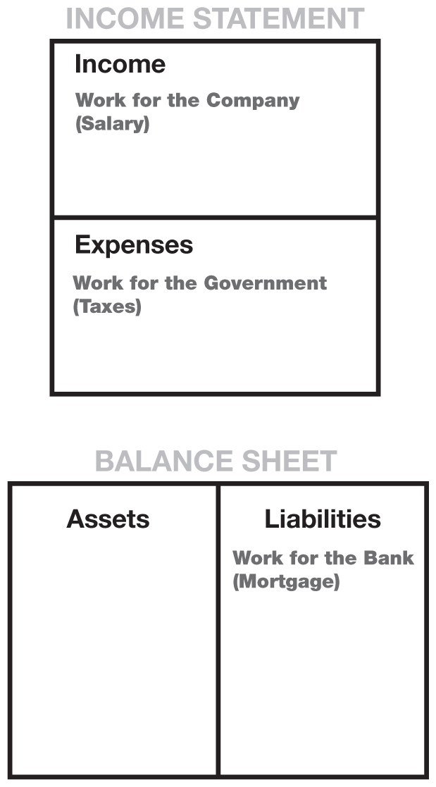

As an employee who is also a homeowner, your working efforts are generally as follows:

* * *

 _**1. You work for the company.**_

Employees make their business owner or the shareholders rich, not themselves. Your efforts and success will help provide for the owner’s success and retirement.

 _**2. You work for the government.**_

The government takes its share from your paycheck before you even see it. By working harder, you simply increase the amount of taxes taken by the government. Most people work from January to May just for the government.

 _**3. You work for the bank.**_

After taxes, your next largest expense is usually your mortgage and credit-card debt.

* * *

The problem with simply working harder is that each of these three levels takes a greater share of your increased efforts. You need to learn how to have your increased efforts benefit you and your family directly.

Once you have decided to concentrate on minding your own business—focusing your efforts on acquiring assets instead of a bigger paycheck—how do you set your goals? Most people must keep their job and rely on their wages to fund their acquisition of assets.

As their assets grow, how do they measure the extent of their success? When does someone know that they are rich, that they have wealth?

As well as having my own definitions for assets and liabilities, I also have my own definition for wealth. Actually, I borrowed it from a man named R. Buckminster Fuller. Some call him a quack, and others call him a genius. Years ago he got architects buzzing because he applied for a patent for something called a geodesic dome. But in the application, Fuller also said something about wealth. It was pretty confusing at first, but after reading it, it began to make some sense:

_Wealth is a person’s ability to survive so many number of days forward—or, if I stopped working today, how long could I survive?_

Unlike net worth—the difference between your assets and liabilities, which is often filled with a person’s expensive junk and opinions of what things are worth—this definition creates the possibility for developing a truly accurate measurement. I could now measure and know where I was in terms of my goal to become financially independent.

Although net worth often includes non-cash-producing assets, like stuff you bought that now sits in your garage, wealth measures how much money your money is making and, therefore, your financial survivability.

Wealth is the measure of the cash flow from the asset column compared with the expense column.

Let’s use an example. Let’s say I have cash flow from my asset column of $1,000 a month. And I have monthly expenses of $2,000. What is my wealth?

Let’s go back to Buckminster Fuller’s definition. Using his definition, how many days forward can I survive? Assuming a 30-day month, I have enough cash flow for half a month.

When I achieve $2,000 a month cash flow from my assets, then I will be wealthy.

So while I’m not yet rich, I am wealthy. I now have income generated from assets each month that fully cover my monthly expenses. If I want to increase my expenses, I first must increase my cash flow to maintain this level of wealth. Also note that it is at this point that I’m no longer dependent on my wages. I have focused on, and been successful in, building an asset column that has made me financially independent. If I quit my job today, I would be able to cover my monthly expenses with the cash flow from my assets.

My next goal would be to have the excess cash flow from my assets reinvested into the asset column. The more money that goes into my asset column, the more my asset column grows. The more my assets grow, the more my cash flow grows. And as long as I keep my expenses less than the cash flow from these assets, I grow richer with more and more income from sources other than my physical labor.

As this reinvestment process continues, I am well on my way to becoming rich. Just remember this simple observation:

* * *

**• The rich buy assets.**

**• The poor only have expenses.**

**• The middle class buy liabilities they think are assets.**

* * *

So how do I start minding my own business? What is the answer? Listen to the founder of McDonald’s in the next chapter.
