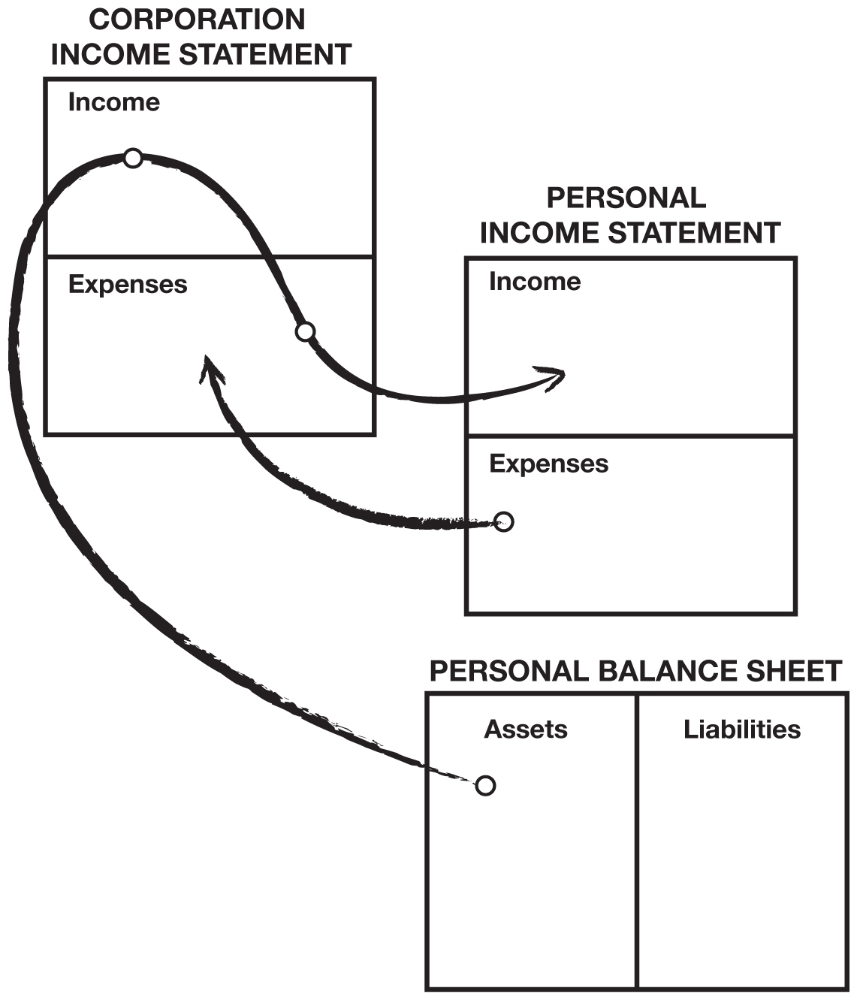
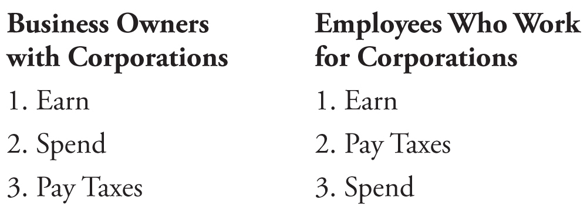

[Chapter Four](Contents.xhtml#krch4)

[LESSON 4: THE HISTORY OF TAXES AND THE POWER OF CORPORATIONS](Contents.xhtml#krch4)

_**My rich dad just played the game smart, and he did it through corporations—the biggest secret of the rich.**_

I remember in school being told the story of Robin Hood and his Merry Men. My teacher thought it was a wonderful story of a romantic hero who robbed from the rich and gave to the poor. My rich dad did not see Robin Hood as a hero. He called Robin Hood a crook.

Robin Hood may be long gone, but his followers live on. I often still hear people say, “Why don’t the rich pay for it?” or “The rich should pay more in taxes and give it to the poor.”

It is this Robin Hood fantasy, or taking from the rich to give to the poor, that has caused the most pain for the poor and the middle class. The reason the middle class is so heavily taxed is because of the Robin Hood ideal. The reality is that the rich are not taxed. It’s the middle class, especially the educated upper-income middle class, who pays for the poor.

Again, to understand fully how things happen, we need to look at the history of taxes. Although my highly educated dad was an expert on the history of education, my rich dad fashioned himself as an expert on the history of taxes.

Rich dad explained to Mike and me that originally, in England and America, there were no taxes. Occasionally, there were temporary taxes levied in order to pay for wars. The king or the president would put the word out and ask everyone to “chip in.” Taxes were levied in Britain for the fight against Napoleon from 1799 to 1816, and in America to pay for the Civil War from 1861 to 1865.

In 1874, England made income tax a permanent levy on its citizens. In 1913, an income tax became permanent in the United States with the adoption of the 16th Amendment to the U.S. Constitution. At one time, Americans were anti-tax. It had been the tax on tea that led to the famous Tea Party in Boston Harbor, an incident that helped ignite the Revolutionary War. It took approximately 50 years in both England and the United States to sell the idea of a regular income tax.

What these historical dates fail to reveal is that both of these taxes were initially levied against only the rich. It was this point that rich dad wanted Mike and me to understand. He explained that the idea of taxes was made popular, and accepted by the majority, by telling the poor and the middle class that taxes were created only to punish the rich. This is how the masses voted for the law, and it became constitutionally legal. Although it was intended to punish the rich, in reality it wound up punishing the very people who voted for it, the poor and middle class.

“Once government got a taste of money, its appetite grew,” said rich dad. “Your dad and I are exactly opposite. He’s a government bureaucrat, and I am a capitalist. We get paid, and our success is measured on opposite behaviors. He gets paid to spend money and hire people. The more he spends and the more people he hires, the larger his organization becomes. In the government, a large organization is a respected organization. On the other hand, within my organization, the fewer people I hire and the less money I spend, the more I am respected by my investors. That’s why I don’t like government people. They have different objectives than most business people. As the government grows, more and more tax dollars are needed to support it.”

My educated dad sincerely believed that government should help people. He loved John F. Kennedy and especially the idea of the Peace Corps. He loved the idea so much that both he and my mom worked for the Peace Corps, training volunteers to go to Malaysia, Thailand, and the Philippines. He always strived for additional grants and budget increases so he could hire more people, both in his job with the Education Department and in the Peace Corps.

From the time I was about 10 years old, I would hear from my rich dad that government workers were a pack of lazy thieves, and from my poor dad I would hear how the rich were greedy crooks who should be made to pay more taxes. Both sides had valid points. It was difficult to go to work for one of the biggest capitalists in town and come home to a father who was a prominent government leader. It was not easy to know which dad to believe.

_**My rich dad did not see Robin Hood as a hero. He called Robin Hood a crook.**_

Yet when you study the history of taxes, an interesting perspective emerges. As I said, the passage of taxes was only possible because the masses believed in the Robin Hood theory of economics: Take from the rich, and give to everyone else. The problem was that the government’s appetite for money was so great that taxes soon needed to be levied on the middle class, and from there it kept trickling down.

However, the rich saw an opportunity because they don’t play by the same set of rules. The rich knew about corporations, which became popular in the days of sailing ships. The rich created the corporation as a vehicle to limit their risk to the assets of each voyage. The rich put their money into a corporation to finance the voyage. The corporation would then hire a crew to sail to the New World to look for treasure. If the ship was lost, the crew lost their lives, but the loss to the rich would be limited only to the money they invested for that particular voyage. The diagram that follows shows how the corporate structure sits outside your personal income statement and balance sheet.

It is the knowledge of the legal corporate structure that really gives the rich a vast advantage over the poor and the middle class. Having two fathers teaching me, one a socialist and the other a capitalist, I quickly began to realize that the philosophy of the capitalist made more financial sense to me. It seemed to me that the socialists ultimately penalized themselves due to their lack of financial education. No matter what the “take-from-the-rich” crowd came up with, the rich always found a way to outsmart them. That is how taxes were eventually levied on the middle class. The rich outsmarted the intellectuals solely because they understood the power of money, a subject not taught in schools.

How did the rich outsmart the intellectuals? Once the “take-from-the-rich” tax was passed, cash started flowing into government coffers. Initially, people were happy. Money was handed out to government workers and the rich. It went to government workers in the form of jobs and pensions, and it went to the rich via their factories receiving government contracts. The government received a large pool of money, but the problem was the fiscal management of that money. The government ideal is to avoid having excess money. If you fail to spend your allotted funds, you risk losing it in the next budget. You would certainly not be recognized for being efficient. Business people, on the other hand, are rewarded for having excess money and are applauded for their efficiency. As this cycle of growing government spending continued, the demand for money increased, and the “tax-the-rich” idea was adjusted to include lower-income levels, down to the very people who voted it in, the poor and the middle class.

True capitalists used their financial knowledge to simply find an escape. They headed back to the protection of a corporation. But what many people who have never formed a corporation don’t know is that a corporation is not really a thing. A corporation is merely a file folder with some legal documents in it, sitting in some attorney’s office and registered with a state government agency. It’s not a big building or a factory or a group of people. A corporation is merely a legal document that creates a legal body without a soul. Using it, the wealth of the rich was once again protected. It was popular because the income-tax rate of a corporation is less than the individual income-tax rates. In addition, certain expenses could be paid by a corporation with pre-tax dollars.

This war between the haves and have-nots has raged for hundreds of years. The battle is waged whenever and wherever laws are made, and it will go on forever. The problem is that the people who lose are the uninformed: the ones who get up every day and diligently go to work and pay taxes. If they only understood the way the rich play the game, they could play it too. Then they would be on their way to their own financial independence. This is why I cringe every time I hear a parent advise their children to go to school so they can find a safe, secure job. An employee with a safe, secure job, without financial aptitude, has no escape.

Average Americans today work four to five months for the government just to cover their taxes. In my opinion, that is simply too long. The harder you work, the more you pay the government. That is why I believe that the idea of “take-from-the-rich” backfired on the very people who voted it in.

Every time people try to punish the rich, the rich don’t simply comply. They react. They have the money, power, and intent to change things. They don’t just sit there and voluntarily pay more taxes. Instead, they search for ways to minimize their tax burden. They hire smart attorneys and accountants, and persuade politicians to change laws or create legal loopholes. They use their resources to effect change.

The Tax Code of the United States also allows other ways to reduce taxes. Most of these vehicles are available to anyone, but it is the rich who find them because they are minding their own business. For example, “1031” is jargon for Section 1031 of the Internal Revenue Code which allows a seller to delay paying taxes on a piece of real estate that is sold for a capital gain through an exchange for a more expensive piece of real estate. Real estate is one investment vehicle that has a great tax advantage. As long as you keep trading up in value, you will not be taxed on the gains until you liquidate. People who don’t take advantage of these legal tax savings are missing a great opportunity to build their asset columns.

The poor and middle class don’t have the same resources. They sit there and let the government’s needles enter their arm and allow the blood donation to begin. Today, I am constantly shocked at the number of people who pay more taxes, or take fewer deductions, simply because they are afraid of the government. I have friends who have had their businesses shut down and destroyed, only to find out it was a mistake on the part of the government. I realize all that. But the price of working from January to May is a high price to pay for that intimidation. My poor dad never fought back. My rich dad didn’t either. He just played the game smarter, and he did it through corporations—the biggest secret of the rich.

You may remember the first lesson I learned from my rich dad. I was a little boy of 9 who had to sit and wait for him to choose to talk to me. I sat in his office waiting for him to get to me. He was ignoring me on purpose. He wanted me to recognize his power and to desire to have that power for myself one day. During all the years I studied and learned from him, he always reminded me that knowledge is power. And with money comes great power that requires the right knowledge to keep it and make it multiply. Without that knowledge, the world pushes you around. Rich dad constantly reminded Mike and me that the biggest bully was not the boss or the supervisor, but the tax man. The tax man will always take more if you let him. The first lesson of having money work for you, as opposed to you working for money, is all about power. If you work for money, you give the power to your employer. If money works for you, you keep the power and control it.

_**If you work for money, you give the power to you employer. If money works for you, you keep the power and control it.**_

Once we had this knowledge of the power of money working for us, he wanted us to be financially smart and not let anyone or anything push us around. If you’re ignorant, it’s easy to be bullied. If you know what you’re talking about, you have a fighting chance. That is why he paid so much for smart tax accountants and attorneys. It was less expensive to pay them than to pay the government. His best lesson to me was: “Be smart and you won’t be pushed around as much.” He knew the law because he was a law-abiding citizen and because it was expensive to not know the law. “If you know you’re right, you’re not afraid of fighting back.” Even if you are taking on Robin Hood and his band of Merry Men.

My highly educated dad always encouraged me to land a good job with a strong corporation. He spoke of the virtues of “working your way up the corporate ladder.” He didn’t understand that, by relying solely on a paycheck from a corporate employer, I would be a docile cow ready for milking.

When I told my rich dad of my father’s advice, he only chuckled. “Why not own the ladder?” was all he said.

As a young boy, I did not understand what rich dad meant by owning my own corporation. It was an idea that seemed impossible and intimidating. Although I was excited by the idea, my inexperience wouldn’t let me envision the possibility that grown-ups would someday work for a company I would own.

The point is that, if not for my rich dad, I would have probably followed my educated dad’s advice. It was merely the occasional reminder of my rich dad that kept the idea of owning my own corporation alive and kept me on a different path. By the time I was 15 or 16, I knew I wasn’t going to continue down the path my educated dad recommended. I didn’t know how I was going to do it, but I was determined not to head in the direction most of my classmates were heading. That decision changed my life.

_**Each dollar in my asset column was a great employee, working hard to make more employees and buy the boss a new Porsche.**_

It was not until my mid-twenties that my rich dad’s advice began to make more sense to me. I was just out of the Marine Corps and working for Xerox. I was making a lot of money, but every time I looked at my paycheck, I was disappointed. The deductions were so large and, the more I worked, the greater they became. As I became more successful, my bosses talked about promotions and raises. It was flattering, but I could hear my rich dad asking in my ear: “Who are you working for? Who are you making rich?”

In 1974, while still an employee for Xerox, I formed my first corporation and began minding my own business. There were already a few assets in my asset column, but now I was determined to focus on making it bigger. Those paychecks, with all the deductions, made all the years of my rich dad’s advice make total sense. I could see the future if I followed my educated dad’s advice.

Many employers feel that advising their workers to mind their own business is bad for business. But for me, focusing on my own business and developing assets made me a better employee because I now had a purpose. I came in early and worked diligently, amassing as much money as possible so I could invest in real estate. Hawaii was just set to boom, and there were fortunes to be made. The more I realized that we were in the beginning stages of a boom, the more Xerox machines I sold. The more I sold, the more money I made and, of course, the more deductions came out of my paycheck. It was inspiring. I wanted out of the employee trap so badly that I worked even harder so I could invest more. By 1978, I was consistently one of the top five sales people at the company. I badly wanted out of the Rat Race.

In less than three years, I was making more in my real estate holding corporation than I was making at Xerox. And the money I was making in my asset column in my own corporation was money working for me, not me pounding on doors selling copiers. My rich dad’s advice made much more sense. Soon the cash flow from my properties was so strong that my company bought me my first Porsche. My fellow Xerox salespeople thought I was spending my commissions. I wasn’t. I was investing my commissions in assets.

My money was working hard to make more money. Each dollar in my asset column was a great employee, working hard to make more employees and buy the boss a new Porsche with before-tax dollars. I began to work harder for Xerox. The plan was working, and my Porsche was the proof. By using the lessons I learned from my rich dad, I was able to get out of the proverbial Rat Race at an early age. It was made possible because of the strong financial knowledge I had acquired through rich dad’s lessons.

Without this financial knowledge, which I call financial intelligence or financial IQ, my road to financial independence would have been much more difficult. I now teach others in the hope that I may share my knowledge with them.

I remind people that financial IQ is made up of knowledge from four broad areas of expertise:

 _**1. Accounting**_

Accounting is financial literacy or the ability to read numbers. This is a vital skill if you want to build an empire. The more money you are responsible for, the more accuracy is required, or the house comes tumbling down. This is the left-brain side, or the details. Financial literacy is the ability to read and understand financial statements which allows you to identify the strengths and weaknesses of any business.

 _**2. Investing**_

Investing is the science of “money making money.” This involves strategies and formulas which use the creative right-brain side.

 _**3. Understanding markets**_

Understanding markets is the science of supply and demand. You need to know the technical aspects of the market, which are emotion-driven, in addition to the fundamental or economic aspects of an investment. Does an investment make sense or does it not make sense based on current market conditions?

 _**4. The law**_

A corporation wrapped around the technical skills of accounting, investing, and markets can contribute to explosive growth. A person who understands the tax advantages and protections provided by a corporation can get rich so much faster than someone who is an employee or a small-business sole proprietor. It’s like the difference between someone walking and someone flying. The difference is profound when it comes to long-term wealth.

**• Tax advantages**

A corporation can do many things that an employee cannot, like pay expenses before paying taxes. That is a whole area of expertise that is very exciting. Employees earn and get taxed, and they try to live on what is left. A corporation earns, spends everything it can, and is taxed on anything that is left. It’s one of the biggest legal tax loopholes that the rich use. They’re easy to set up and are not expensive if you own investments that are producing good cashflow. For example, by owning your own corporation, your vacations can be board meetings in Hawaii. Car payments, insurance, repairs, and health-club memberships are company expenses. Most restaurant meals are partial expenses, and on and on. But it’s done legally with pre-tax dollars.

**• Protection from lawsuits**

We live in a litigious society. Everybody wants a piece of your action. The rich hide much of their wealth using vehicles such as corporations and trusts to protect their assets from creditors. When someone sues a wealthy individual, they are often met with layers of legal protection and often find that the wealthy person actually owns nothing. They control everything, but own nothing. The poor and middle class try to own everything and lose it to the government or to fellow citizens who like to sue the rich. They learned it from the Robin Hood story: Take from the rich, and give it to the poor.

It is not the purpose of this book to go into the specifics of owning a corporation. But I will say that if you own any kind of legitimate assets, I would consider finding out more about the benefits and protection offered by a corporation as soon as possible. There are many books written on the subject that will detail the benefits and even walk you through the steps necessary to set up a corporation. Garret Sutton’s books on corporations provide wonderful insight into the power of personal corporations.

Financial IQ is actually the synergy of many skills and talents. I would say it is the combination of the four technical skills listed above that make up basic financial intelligence. If you aspire to great wealth, it is the combination of these skills that will greatly amplify your financial intelligence.

In summary:

As part of your overall financial strategy, I recommend that you learn about the protection that legal entities can provide for businesses and assets.
