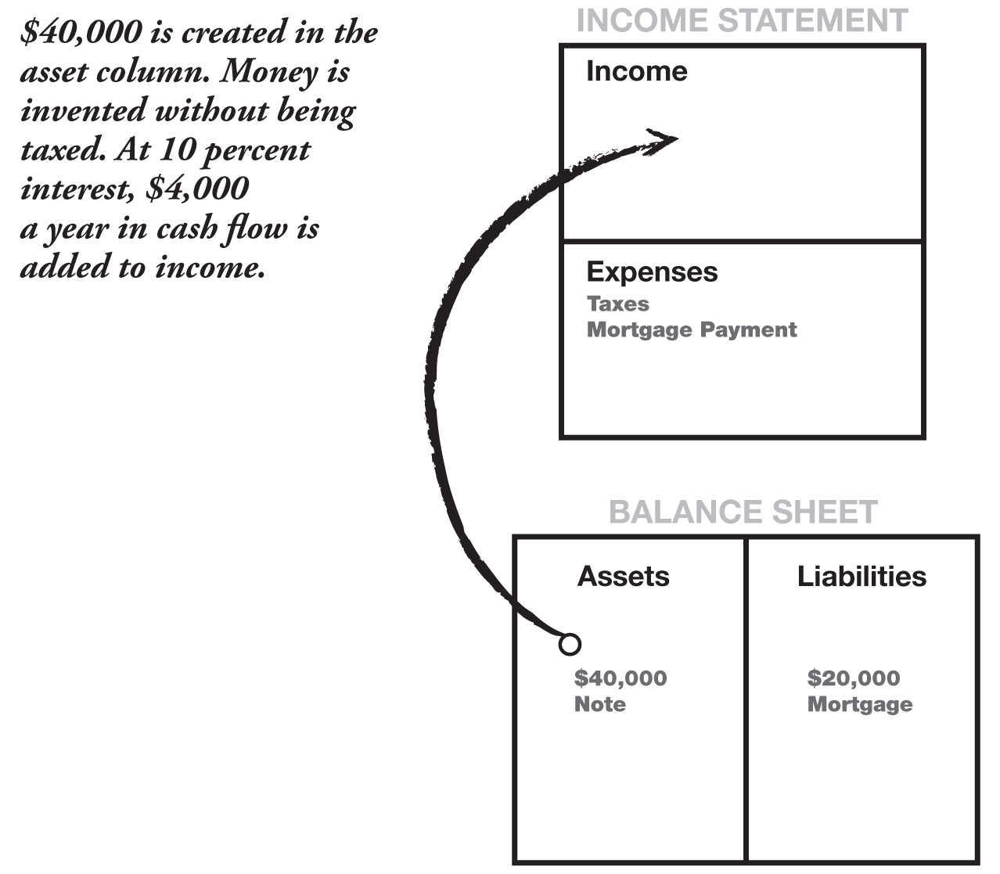
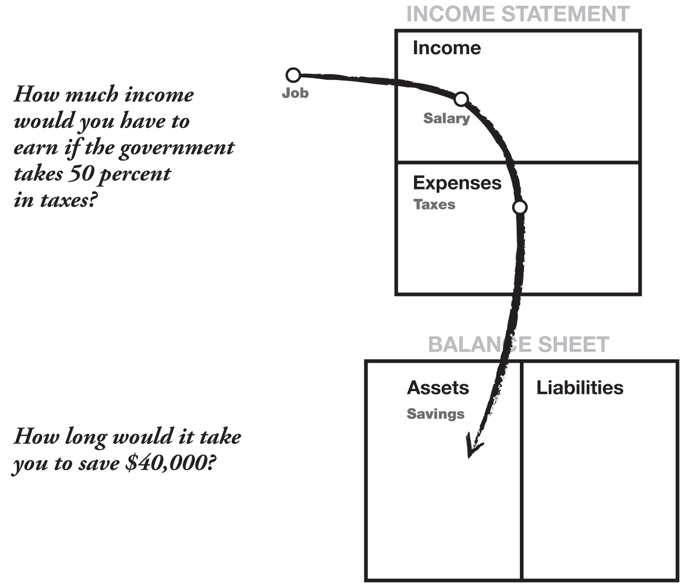

[Chapter Five](Contents.xhtml#krch5)

[LESSON 5: THE RICH INVENT MONEY](Contents.xhtml#krch5)

_**Often in the real world, it’s not the smart who get ahead, but the bold.**_

Last night, I took a break from writing and watched a TV program on the history of a young man named Alexander Graham Bell. Bell had just patented his telephone and was having growing pains because the demand for his new invention was so strong. Needing a bigger company, he then went to the giant at that time, Western Union, and asked them if they would buy his patent and his tiny company. He wanted $100,000 for the whole package. The president of Western Union scoffed at him and turned him down, saying the price was ridiculous. The rest is history. A multi-billion-dollar industry emerged, and AT&T was born.

The evening news came on right after the story of Alexander Graham Bell. On the news was a story of another downsizing at a local company. The workers were angry and complained that the company ownership was unfair. A terminated manager of about 45 years of age had his wife and two babies at the plant and was begging the guards to let him talk to the owners to ask if they would reconsider his termination. He had just bought a house and was afraid of losing it. The camera focused in on his pleading for all the world to see. Needless to say, it held my attention.

I have been teaching professionally since 1984. It has been a great experience and a rewarding one. It is also a disturbing profession, for I have taught thousands of individuals and I see one thing in common in all of us, myself included. We all have tremendous potential, and we all are blessed with gifts. Yet the one thing that holds all of us back is some degree of self-doubt. It is not so much the lack of technical information that holds us back, but more the lack of self-confidence. Some are more affected than others.

Once we leave school, most of us know that it is not so much a matter of college degrees or good grades that count. In the real world outside of academics, something more than just grades is required. I have heard it called many things; guts, chutzpah, balls, audacity, bravado, cunning, daring, tenacity, and brilliance. This factor, whatever it is labeled, ultimately decides one’s future much more than school grades do.

Inside each of us is one of these brave, brilliant, and daring characters. There is also the flip side of that character: people who could get down on their knees and beg if necessary. After a year in Vietnam as a Marine Corps pilot, I got to know both of those characters inside of me intimately. One is not better than the other.

Yet as a teacher, I recognized that it was excessive fear and self-doubt that were the greatest detractors of personal genius. It broke my heart to see students know the answers, yet lack the courage to act on the answer. Often in the real world, it’s not the smart who get ahead, but the bold.

In my personal experience, your financial genius requires both technical knowledge as well as courage. If fear is too strong, the genius is suppressed. In my classes, I strongly urge students to learn to take risks, to be bold, and to let their genius convert that fear into power and brilliance. It works for some and just terrifies others. I have come to realize that for most people, when it comes to the subject of money, they would rather play it safe. I have had to field questions such as: “Why take risks?” “Why should I bother developing my financial IQ?” “Why should I become financially literate?” And I answer, “Just to have more options.”

There are huge changes up ahead. In the coming years, there will be more people just like the young inventor Alexander Graham Bell. There will be a hundred people like Bill Gates and hugely successful companies like Microsoft created every year, all over the world. And there also will be many more bankruptcies, layoffs, and downsizings.

So why bother developing your financial IQ? No one can answer that but you. Yet I can tell you why I myself do it. I do it because it is the most exciting time to be alive. I’d rather be welcoming change than dreading change. I’d rather be excited about making millions than worrying about not getting a raise. This period we are in now is a most exciting time, unprecedented in our world’s history. Generations from now, people will look back at this period of time and remark at what an exciting era it must have been. It was the death of the old and birth of the new. It was full of turmoil, and it was exciting.

So why bother developing your financial IQ? Because if you do, you will prosper greatly. And if you don’t, this period of time will be a frightening one. It will be a time of watching some people move boldly forward while others cling to worn-out life preservers.

Land was wealth 300 years ago. So the person who owned the land owned the wealth. Later, wealth was in factories and production, and America rose to dominance. The industrialist owned the wealth. Today, wealth is in information. And the person who has the most timely information owns the wealth. The problem is that information flies around the world at the speed of light. The new wealth cannot be contained by boundaries and borders as land and factories were. The changes will be faster and more dramatic. There will be a dramatic increase in the number of new multimillionaires. There also will be those who are left behind.

I find so many people struggling today, often working harder, simply because they cling to old ideas. They want things to be the way they were, and they resist change. I know people who are losing their jobs or their houses, and they blame technology or the economy or their boss. Sadly, they fail to realize that they might be the problem. Old ideas are their biggest liability. It is a liability simply because they fail to realize that while that idea or way of doing something was an asset yesterday, yesterday is gone.

One afternoon I was teaching how to invest using a board game I had invented, _CASHFLOW_ ®, as a teaching tool. A friend had brought someone along to attend the class. This friend of a friend was recently divorced, had been badly burned in the divorce settlement, and was now searching for some answers. Her friend thought the class might help.

The game was designed to help people learn how money works. In playing the game, they learn about the interaction of the income statement with the balance sheet. They learn how cash flows between the two and how the road to wealth is through striving to increase your monthly cash flow from the asset column to the point that it exceeds your monthly expenses. Once you accomplish this, you are able to get out of the Rat Race and out onto the Fast Track.

_**You can play CASHFLOW Classic on the web at[www.richdad.com](http://www.richdad.com) and learn how money works.**_

As I have said, some people hate the game, some love it, and others miss the point. This woman missed a valuable opportunity to learn something. In the opening round, she drew a “doodad” card with the boat on it. At first she was happy. “Oh, I’ve got a boat.” Then, as her friend tried to explain how the numbers worked on her income statement and balance sheet, she got frustrated because she had never liked math. The rest of her table waited while her friend continued explaining the relationship between the income statement, balance sheet, and monthly cash flow. Suddenly, when she realized how the numbers worked, it dawned on her that her boat was eating her alive. Later on in the game, she was also downsized and had a child. It was a horrible game for her.

After the class, her friend came by and told me that she was upset. She had come to the class to learn about investing and did not like the idea that it took so long to play a silly game.

Her friend attempted to tell her to look within herself to see if the game reflected her in any way. With that suggestion, the woman demanded her money back. She said that the very idea that a game could be a reflection of her was ridiculous. Her money was promptly refunded, and she left.

Since 1984, I have made millions simply by doing what the school system does not do. In school, most teachers lecture. I hated lectures as a student. I was soon bored, and my mind would drift.

In 1984, I began teaching via games and simulations, and I still rely on these tools today. I always encourage adult students to look at games as reflecting back to them what they know and what they need to learn. Most importantly, games reflect behavior. They are instant feedback systems. Instead of the teacher lecturing you, the game is giving you a personalized lecture, one that is custom-made just for you.

The friend of the woman who left later called to give me an update. She said her friend was fine and had calmed down. In her cooling-off period, she could see some slight relationship between the game and her life. Although she and her husband did not own a boat, they did own everything else imaginable. She was angry after their divorce, both because he had run off with a younger woman and because, after twenty years of marriage, they had accumulated little in the way of assets. There was virtually nothing for them to split. Their twenty years of married life had been incredible fun, but all they had accumulated was a ton of doodads.

_**Games reflect behavior. They are instant feedback systems.**_

She realized that her anger at doing the numbers—the income statement and balance sheet—came from her embarrassment about not understanding them. She had believed that finances were the man’s job. She maintained the house and did the entertaining, and he handled the finances. She was now quite certain, that in the last five years of their marriage, he had hidden money from her. She was angry at herself for not being more aware of where the money was going, as well as for not knowing about the other woman.

Just like a board game, the world is always providing us with instant feedback. We could learn a lot if we tuned in more. One day not long ago, I complained to my wife that the cleaners must have shrunk my pants. My wife gently smiled and poked me in the stomach to inform me that the pants had not shrunk. Something else had expanded—me!

The _CASHFLOW_ game was designed to give every player personal feedback. Its purpose is to give you options. If you draw the boat card and it puts you into debt, the question is: “Now what can you do? How many different financial options can you come up with?” That is the purpose of the game: to teach players to think and create new and various financial options. Thousands of people throughout the world have played this game. The players who get out of the Rat Race the quickest are the people who understand numbers and have creative financial minds. They recognize different financial options. Rich people are often creative and take calculated risks. People who take the longest are people who are not familiar with numbers and often do not understand the power of investing.

Some people playing _CASHFLOW_ gain lots of money in the game, but they don’t know what to do with it. Even though they have money, everyone else seems to be getting ahead of them. And that is true in real life. There are a lot of people who have a lot of money and do not get ahead financially.

_**Play CASHFLOW Classic on the web at[www.richdad.com](http://www.richdad.com)**_

_**What did you learn about your true behavior from playing the game**_

Limiting your options is the same as hanging on to old ideas. I have a friend from high school who now works at three jobs. Years ago, he was the richest of all my classmates. When the local sugar plantation closed, the company he worked for went down with the plantation. In his mind, he had but one option, and that was the old option: Work hard. The problem was that he couldn’t find an equivalent job that recognized his seniority from the old company. As a result, he is overqualified for the jobs he currently has, so his salary is lower. He now works three jobs to earn enough to survive.

I have watched people playing _CASHFLOW_ complain that the right opportunity cards are not coming their way. So they sit there. I know people who do that in real life. They wait for the right opportunity.

I have watched people get the right opportunity card and then not have enough money. Then they complain that they would have gotten out of the Rat Race if they had had more money. So they sit there. I know people in real life who do that also. They see all the great deals, but they have no money.

And I have seen people pull a great opportunity card, read it out loud, and have no idea that it is a great opportunity. They have the money, the time is right, they have the card, but they can’t see the opportunity staring them in the face. They fail to see how it fits into their financial plan for escaping the Rat Race. And I know more people like that than all the others combined. Most people have an opportunity of a lifetime flash right in front of them, and they fail to see it. A year later, they find out about it, after everyone else got rich.

Financial intelligence is simply having more options. If the opportunities aren’t coming your way, what else can you do to improve your financial position? If an opportunity lands in your lap and you have no money and the bank won’t talk to you, what else can you do to get the opportunity to work in your favor? If your hunch is wrong, and what you’ve been counting on doesn’t happen, how can you turn a lemon into millions? That is financial intelligence. It is not so much what happens, but how many different financial solutions you can think of to turn a lemon into millions. It is how creative you are in solving financial problems.

Most people only know one solution: Work hard, save, and borrow. So why would you want to increase your financial intelligence? Because you want to be the kind of person who creates your own luck. You take whatever happens and make it better. Few people realize that luck is created, just as money is. And if you want to be luckier and create money instead of working hard, then your financial intelligence is important. If you are the kind of person who is waiting for the right thing to happen, you might wait for a long time. It’s like waiting for all the traffic lights to be green for five miles before you’ll start your trip.

As young boys, Mike and I were constantly told by my rich dad that “money is not real.” Rich dad occasionally reminded us of how close we came to the secret of money on that first day we got together and began “making money” out of plaster of paris. “The poor and middle class work for money,” he would say. “The rich make money. The more real you think money is, the harder you will work for it. If you can grasp the idea that money is not real, you will grow richer faster.”

“What is it?” was a question Mike and I often came back with. “What is money if it is not real?”

“What we agree it is,” was all rich dad would say.

The single most powerful asset we all have is our mind. If it is trained well, it can create enormous wealth seemingly instantaneously. An untrained mind can also create extreme poverty that can crush a family for generations.

In the Information Age, money is increasing exponentially. A few individuals are getting ridiculously rich from nothing, just ideas and agreements. If you ask many people who trade stocks or other investments for a living, they see it done all the time. Often, millions can be made instantaneously from nothing. And by nothing, I mean no money was exchanged. It is done via agreement: a hand signal in a trading pit, a blip on a trader’s screen in Lisbon from a trader’s screen in Toronto and back to Lisbon, a call to my broker to buy and a moment later to sell. Money did not change hands. Agreements did.

_**The single most powerful asset we all have is our mind. If it is trained well, it can create enormous wealth.**_

So why develop your financial genius? Only you can answer that. I can tell you why I have been developing this area of my intelligence. I do it because I want to make money fast. Not because I need to, but because I want to. It is a fascinating learning process. I develop my financial IQ because I want to participate in the fastest game and biggest game in the world. And in my own small way, I would like to be part of this unprecedented evolution of humanity, the era where humans work purely with their minds and not with their bodies. Besides, it is where the action is. It is what is happening. It’s hip. It’s scary. And it’s fun.

That is why I invest in my financial intelligence, developing the most powerful asset I have. I want to be with people moving boldly forward. I do not want to be with those left behind.

I will give you a simple example of creating money. In the early 1990s, the economy of Phoenix, Arizona, was horrible. I was watching a TV show when a financial planner came on and began forecasting doom and gloom. His advice was to save money. “Put $100 away every month,” he said. “In 40 years you will be a multimillionaire.”

Well, putting money away every month is a sound idea. It is one option—the option most people subscribe to. The problem is this: It blinds the person to what is really going on. It causes them to miss major opportunities for much more significant growth of their money. The world is passing them by.

As I said, the economy was terrible at that time. For investors, this is the perfect market condition. A chunk of my money was in the stock market and in apartment houses. I was short of cash. Because people were giving properties away, I was buying. I was not saving money. I was investing. Kim and I had more than a million dollars in cash working in a market that was rising fast. It was the best opportunity to invest. The economy was terrible. I just could not pass up these small deals.

Houses that were once $100,000 were now $75,000. But instead of shopping with local real estate agents, I began shopping at the bankruptcy attorney’s office, or the courthouse steps. In these shopping places, a $75,000 house could sometimes be bought for $20,000 or less. For $2,000, which was loaned to me from a friend for 90 days for $200, I gave an attorney a cashier’s check as a down payment. While the acquisition was being processed, I ran an ad advertising a $75,000 house for only $60,000 and no money down. The phone rang hard and heavy. Prospective buyers were screened and once the property was legally mine, all the prospective buyers were allowed to look at the house. It was a feeding frenzy. The house sold in a few minutes. I asked for a $2,500 processing fee, which they gladly handed over, and the escrow and title company took over from there. I returned the $2,000 to my friend with an additional $200. He was happy, the home buyer was happy, the attorney was happy, and I was happy. I had sold a house for $60,000 that cost me $20,000. The $40,000 was created from money in my asset column in the form of a promissory note from the buyer. Total working time: five hours.

So now that you are on your way to becoming more financially literate and skilled at reading numbers, I will show you why this is an example of money being invented.

During this depressed market, Kim and I were able to do six of these simple transactions in our spare time. While the bulk of our money was in larger properties and the stock market, we were able to create more than $190,000 in assets (notes at 10 percent interest) in those six “buy, create, and sell” transactions. That comes to approximately $19,000 a year income, much of it sheltered through our private corporation. Much of that $19,000 a year goes to pay for our company cars, gas, trips, insurance, dinners with clients, and other things. By the time the government gets a chance to tax that income, it’s been spent on legally allowed pre-tax expenses.

This was a simple example of how money is invented, created, and protected using financial intelligence.

Ask yourself: How long would it take to save $190,000? Would the bank pay you 10 percent interest on your money? And the promissory note is good for 30 years. I hope they never pay me the $190,000. I have to pay a tax if they pay me the principal, and besides, $19,000 paid over 30 years is a little over $500,000 in income.

I have people ask what happens if the person doesn’t pay. That does happen, and it’s good news. That $60,000 home could be taken back and re-sold for $70,000, and another $2,500 collected as a loan-processing fee. It would still be a zero-down transaction in the mind of the new buyer. And the process would go on.

The first time I sold the house, I paid back the $2,000, so technically, I have no money in the transaction. My return on investment (ROI) is infinity. It’s an example of no money making a lot of money.

In the second transaction, when re-sold, I would have put $2,000 in my pocket and re-extended the loan to 30 years. What would my ROI be if I got paid money to make money? I do not know, but it sure beats saving $100 a month, which actually starts out as $150 because it’s after-tax income for 40 years earning low interest. And again, you’re taxed on the interest. That is not too intelligent. It may be safe, but it’s not smart.

A few years later, as the Phoenix real estate market strengthened, those houses we sold for $60,000 became worth $110,000. Foreclosure opportunities were still available, but became rare. It cost a valuable asset, my time, to go out looking for them. Thousands of buyers were looking for the few available deals. The market had changed. It was time to move on and look for other opportunities to put in the asset column.

“You can’t do that here.” “That is against the law.” “You’re lying.” I hear those comments much more often than “Can you show me how to do that?” The math is simple. You do not need algebra or calculus. And the escrow company handles the legal transaction and the servicing of the payments. I have no roofs to fix or toilets to unplug because the owners do that. It’s their house. Occasionally someone does not pay. And that is wonderful because there are late fees, or they move out and the property is sold again. The court system handles that.

And it may not work in your area. The market conditions may be different. But the example illustrates how a simple financial process can create hundreds of thousands of dollars, with little money and low risk. It is an example of money being only an agreement. Anyone with a high school education can do it.

Yet most people won’t. Most people listen to the standard advice of “Work hard and save money.”

For about 30 hours of work, approximately $190,000 was created in the asset column, and no taxes were paid.

* * *

_**Which one sounds harder to you?**_

**1. Work hard. Pay 50% in taxes. Save what is left.**

**Your savings then earn 5%, which is also taxed.**

**OR**

**2. Take the time to develop your financial intelligence**

**Harness the power of your brain and the asset column.**

* * *

If you use option number one, be sure to factor in how much time it takes you to save $190,000. Time is one of your greatest assets.

Now you may understand why I silently shake my head when I hear parents say, “My child is doing well in school and receiving a good education.” It may be good, but is it adequate?

I know the above investment strategy is a small one. It is used to illustrate how small can grow into big. Again, my success reflects the importance of a strong financial foundation, which starts with a strong financial education.

I have said it before, but it’s worth repeating. Financial intelligence is made up of these four main technical skills:

* * *

 _**1. Accounting**_

Accounting is financial literacy, or the ability to read numbers. This is a vital skill if you want to build businesses or investments.

 _**2. Investing**_

Investing is the science of money making money.

 _**3. Understanding markets**_

Understanding markets is the science of supply and demand Alexander Graham Bell gave the market what it wanted. So did Bill Gates. A $75,000 house offered for $60,000 that cost $20,000 was also the result of seizing an opportunity created by the market. Somebody was buying, and someone was selling.

 _**4. The law**_

The law is the awareness of accounting corporate, state and federal regulations. I recommend playing by the rules.

* * *

It is this basic foundation, or the combination of these skills, that is needed to be successful in the pursuit of wealth, whether it be through the buying of small homes, apartment buildings, companies, stocks, bonds, precious metals, baseball cards, or the like.

A few years later, the real estate market rebounded and everyone else was getting in. The stock market was booming, and everyone was getting in. The U.S. economy was getting back on its feet. I began selling and was now traveling to Peru, Norway, Malaysia, and the Philippines. The investment landscape had changed. We were no longer buying real estate. Now I just watch the values climb inside the asset column and will probably begin selling. I suspect that some of those six little house deals will sell and the $40,000 note will be converted to cash. I need to call my accountant to be prepared for cash and seek ways to shelter it.

The point I would like to make is that investments come and go. The market goes up and comes down. Economies improve and crash. The world is always handing you opportunities of a lifetime, every day of your life, but all too often we fail to see them. But they are there. And the more the world changes and the more technology changes, the more opportunities there will be to allow you and your family to be financially secure for generations to come.

So why bother developing your financial intelligence? Again, only you can answer that. I know why I continue to learn and develop. I do it because I know there are changes coming. I’d rather welcome change than cling to the past. I know there will be market booms and market crashes. I want to continually develop my financial intelligence because, at each market change, some people will be on their knees begging for their jobs. Others, meanwhile, will take the lemons that life hands them—and we are all handed lemons occasionally—and turn them into millions. That’s financial intelligence.

I am often asked about the lemons I have turned into millions. I hesitate using many more examples of personal investments because I am afraid it comes across as bragging or tooting my own horn. That is not my intention. I use the examples only as numerical and chronological illustrations of actual and simple cases. I use the examples because I want you to know that it is easy. And the more familiar you become with the four pillars of financial intelligence, the easier it becomes.

Personally, I use two main vehicles to achieve financial growth: real estate and small-cap stocks. I use real estate as my foundation. Day in and day out, my properties provide cash flow and occasional spurts of growth in value. The small-cap stocks are used for fast growth.

I do not recommend anything that I do. The examples are just that—examples. If the opportunity is too complex and I do not understand the investment, I don’t do it. Simple math and common sense are all you need to do well financially.

* * *

_**There are five reasons for using examples:**_

1. To inspire people to learn more.

2. To let people know it is easy if the foundation is strong.

3. To show that anyone can achieve great wealth.

4. To show that there are millions of ways to achieve your goals.

5. To show that it’s not rocket science.

* * *

In 1989, I used to jog through a lovely neighborhood in Portland, Oregon. It was a suburb that had little gingerbread houses. They were small and cute. I almost expected to see Little Red Riding Hood skipping down the sidewalk on her way to Granny’s.

There were “For Sale” signs everywhere. The timber market was terrible, the stock market had just crashed, and the economy was depressed. On one street, I noticed a for-sale sign that was up longer than most. It looked old. Jogging past it one day, I ran into the owner, who looked troubled.

“What are you asking for your house?” I asked.

The owner turned and smiled weakly. “Make me an offer,” he said. “It’s been for sale for over a year. Nobody even comes by anymore to look at it.”

“I’ll look,” I said, and I bought the house a half hour later for $20,000 less than his asking price.

It was a cute little two-bedroom home, with gingerbread trim on all the windows. It was light blue with gray accents and had been built in 1930. Inside there was a beautiful rock fireplace, as well as two tiny bedrooms. It was a perfect rental house.

I gave the owner $5,000 down for a $45,000 house that was really worth $65,000, except that no one wanted to buy it. The owner moved out in a week, happy to be free, and my first tenant moved in, a local college professor. After the mortgage, expenses, and management fees were paid, I put a little less than $40 in my pocket at the end of each month. Hardly exciting.

A year later, the depressed Oregon real estate market had begun to pick up. California investors, flush with money from their still booming real estate market, were moving north and buying up Oregon and Washington. I sold that little house for $95,000 to a young couple from California who thought it was a bargain. My capital gains of approximately $40,000 were placed into a 1031 tax-deferred exchange, and I went shopping for a place to put my money. In about a month, I found a 12-unit apartment house right next to the Intel plant in Beaverton, Oregon. The owners lived in Germany, had no idea what the place was worth, and again, just wanted to get out of it. I offered $275,000 for a $450,000 building. They agreed to $300,000. I bought it and held it for two years. Utilizing the same 1031-exchange process, we sold the building for $495,000 and bought a 30-unit apartment building in Phoenix, Arizona. We had moved to Phoenix by then to get out of the rain, and needed to sell anyway. Like the former Oregon market, the real estate market in Phoenix was depressed. The price of the 30-unit apartment building in Phoenix was $875,000, with $225,000 down. The cash flow from the 30 units was a little over $5,000 a month.

_**The problem with “secure” investments is that they are often sanitized, that is, made so safe that the gains are less.**_

The Arizona market began moving up and, a few years later, a Colorado investor offered us $1.2 million for the property.

The point of this example is how a small amount can grow into a large amount. Again, it is a matter of understanding financial statements, investment strategies, a sense of the market, and the laws.

If people are not versed in these subjects, then obviously they must follow standard dogma, which is to play it safe, diversify, and only invest in secure investments. The problem with “secure” investments is that they are often sanitized, that is, made so safe that the gains are less.

Most large brokerage houses will not touch speculative transactions in order to protect themselves and their clients. And that is a wise policy. The really hot deals are not offered to people who are novices. Often, the best deals that make the rich even richer are reserved for those who understand the game. It is technically illegal to offer speculative deals to someone who is considered not sophisticated, but of course it happens. The more sophisticated I get, the more opportunities come my way.

Another case for developing your financial intelligence over a lifetime is simply that more opportunities are presented to you. And the greater your financial intelligence, the easier it is to tell whether a deal is good. It’s your intelligence that can spot a bad deal, or make a bad deal good. The more I learn—and there is a lot to learn—the more money I make simply because I gain experience and wisdom as the years go on. I have friends who are playing it safe, working hard at their profession, and failing to gain financial wisdom, which does take time to develop.

My overall philosophy is to plant seeds inside my asset column That is my formula. I start small and plant seeds. Some grow; some don’t. Inside our real estate corporation, we have property worth several million dollars. It is our own REIT, or real estate investment trust.

The point I’m making is that most of those millions started out as little $5,000 to $10,000 investments. All of those down payments were fortunate to catch a fast-rising market and increase tax-free. We traded in and out several times over a number of years.

We also own a stock portfolio, surrounded by a corporation that Kim and I call our “personal mutual fund.” We have friends who deal specifically with investors like us who have extra money each month to invest. We buy high-risk, speculative private companies that are just about to go public on a stock exchange in the United States or Canada. An example of how fast gains can be made are 100,000 shares purchased for 25 cents each before the company goes public. Six months later, the company is listed, and the 100,000 shares now are worth $2 each. If the company is well managed, the price keeps going up, and the stock may go to $20 or more per share. There are years when our $25,000 has gone to a million in less than a year.

It is not gambling if you know what you’re doing. It is gambling if you’re just throwing money into a deal and praying. The idea in anything is to use your technical knowledge, wisdom, and love of the game to cut the odds down, to lower the risk. Of course, there is always risk. It is financial intelligence that improves the odds. Thus, what is risky for one person is less risky to someone else. That is the primary reason I constantly encourage people to invest more in their financial education than in stocks, real estate, or other markets. The smarter you are, the better chance you have of beating the odds.

The stock plays I personally invested in were extremely high-risk for most people and absolutely not recommended. I have been playing that game since 1979 and have paid more than my share in dues. But if you will reread why investments such as these are high-risk for most people, you may be able to set your life up differently, so that the ability to take $25,000 and turn it into $1 million in a year is low-risk for you.

As stated earlier, nothing I have written is a recommendation. It is only used as an example of what is simple and possible. What I do is small potatoes in the grand scheme of things. Yet for the average individual, a passive income of more than $100,000 a year is nice and not hard to achieve. Depending on the market and how smart you are, it could be done in five to 10 years. If you keep your living expenses modest, $100,000 coming in as additional income is pleasant, regardless of whether you work. You can work if you like or take time off if you choose and use the government tax system in your favor, rather than against you.

_**It is not gambling if you know what you’re doing. It is gambling if you’re just throwing money into a deal and praying.**_

My personal basis is real estate. I love real estate because it’s stable and slow-moving. I keep the base solid. The cash flow is fairly steady and, if properly managed, has a good chance of increasing in value. The beauty of a solid base of real estate is that it allows me to take greater risks, as I do with speculative stocks.

If I make great profits in the stock market, I pay my capital-gains tax on the gain and then reinvest what’s left in real estate, again further securing my asset foundation.

A last word on real estate: I have traveled all over the world and taught investing. In every city, I hear people say you cannot buy real estate cheap. That is not my experience. Even in New York or Tokyo, or just on the outskirts of the city, prime bargains are overlooked by most people. In Singapore, with their high real estate prices, there are still bargains to be found within a short driving distance. So whenever I hear someone say, “You can’t do that here,” pointing at me, I remind them that maybe the real statement is, “I don’t know how to do that here—yet.”

Great opportunities are not seen with your eyes. They are seen with your mind. Most people never get wealthy simply because they are not trained financially to recognize opportunities right in front of them.

I am often asked, “How do I start?”

In the final chapter of this book, I offer 10 steps that I followed on the road to my financial freedom. But always remember to have fun. When you learn the rules and the vocabulary of investing and begin to build your asset column, I think you’ll find that it’s as fun a game as you’ve ever played. Sometimes you win and sometimes you learn. But have fun. Most people never win because they’re more afraid of losing. That is why I found school so silly. In school we learn that mistakes are bad, and we are punished for making them. Yet if you look at the way humans are designed to learn, we learn by making mistakes. We learn to walk by falling down. If we never fell down, we would never walk. The same is true for learning to ride a bike. I still have scars on my knees, but today I can ride a bike without thinking. The same is true for getting rich. Unfortunately, the main reason most people are not rich is because they are terrified of losing. Winners are not afraid of losing. But losers are. Failure is part of the process of success. People who avoid failure also avoid success.

_**Great opportunities are not seen with your eyes. They are seen with your mind.**_

I look at money much like my game of tennis. I play hard, make mistakes, correct, make more mistakes, correct, and get better. If I lose the game, I reach across the net, shake my opponent’s hand, smile, and say, “See you next Saturday.”

There are two kinds of investors:

1. The first and most common type is a person who buys a packaged investment. They call a retail outlet, such as a real estate company, a stockbroker, or a financial planner, and they buy something. It could be a mutual fund, a REIT, a stock or a bond. It is a clean and simple way of investing. An analogy would be a shopper who goes to a computer store and buys a computer right off the shelf.

2. The second type is an investor who creates investments. This investor usually assembles a deal in the same way a person who buys components builds a computer. I do not know the first thing about putting components of a computer together, but I do know how to put pieces of opportunities together, or know people who know how.

It is this second type of investor who is the more professional investor. Sometimes it may take years for all the pieces to come together. And sometimes they never do. It’s this second type of investor that my rich dad encouraged me to be. It is important to learn how to put the pieces together, because that is where the huge wins reside, and sometimes some huge losses if the tide goes against you.

If you want to be the second type of investor, you need to develop three main skills.

**1. Find an opportunity that everyone else missed.**

You see with your mind what others miss with their eyes. For example, a friend bought this rundown old house. It was spooky to look at. Everyone wondered why he bought it. What he saw that we did not was that the house came with four extra empty lots. He discovered that after going to the title company. After buying the house, he tore the house down and sold the five lots to a builder for three times what he paid for the entire package. He made $75,000 for two months of work. It’s not a lot of money, but it sure beats minimum wage. And it’s not technically difficult.

**2. Raise money.**

The average person only goes to the bank. This second type of investor needs to know how to raise capital, and there are many ways that don’t require a bank. To get started, I learned how to buy houses without a bank. It was the learned skill of raising money, more than the houses themselves, that was priceless.

All too often I hear people say, “The bank won’t lend me money,” or “I don’t have the money to buy it.” If you want to be a type-two investor, you need to learn how to do that which stops most people. In other words, a majority of people let their lack of money stop them from making a deal. If you can avoid that obstacle, you will be millions ahead of those who don’t learn those skills. There have been many times I have bought a house, a stock, or an apartment building without a penny in the bank. I once bought an apartment house for $1.2 million. I did what is called “tying it up,” with a written contract between seller and buyer.

I then raised the $100,000 deposit, which bought me 90 days to raise the rest of the money. Why did I do it? Simply because I knew it was worth $2 million. I never raised the money. Instead, the person who put up the $100,000 gave me $50,000 for finding the deal, took over my position, and I walked away. Total working time: three days. Again, it’s what you know more than what you buy. Investing is not buying. It’s more a case of knowing.

**3. Organize smart people.**

Intelligent people are those who work with or hire a person who is more intelligent than they are. When you need advice, make sure you choose your advisor wisely.

There is a lot to learn, but the rewards can be astronomical. If you do not want to learn those skills, then being a type-one investor is highly recommended. It is what you know that is your greatest wealth. It is what you do not know that is your greatest risk.

There is always risk, so learn to manage risk instead of avoiding it.
