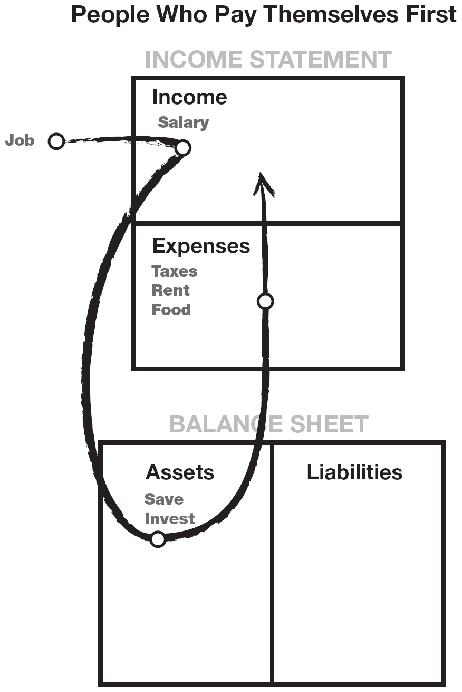
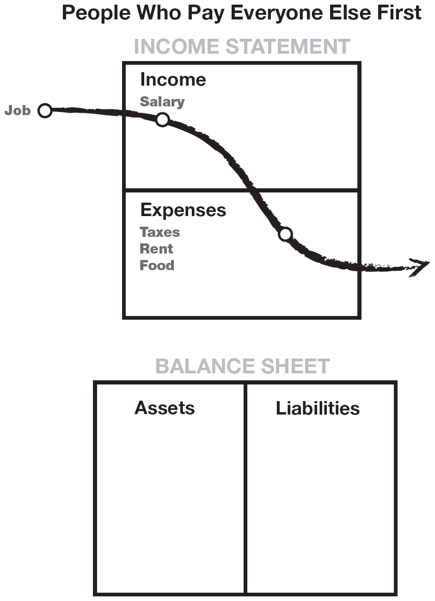

[Chapter Eight](Contents.xhtml#krch8)

[GETTING STARTED](Contents.xhtml#krch8)

_**There is gold everywhere. Most people are not trained to see it.**_

I wish I could say acquiring wealth was easy for me, but it wasn’t.

So in response to the question “How do I start?” I offer the thought process I go through on a day-to-day basis. It really is easy to find great deals. I promise you that. It’s just like riding a bike. After a little wobbling, it’s a piece of cake. But when it comes to money, it takes determination to get through the wobbling. That’s a personal thing.

To find million-dollar “deals of a lifetime” requires us to call on our financial genius. I believe that each of us has a financial genius within us. The problem is that our financial genius lies asleep, waiting to be called upon. It lies asleep because our culture has educated us into believing that the love of money is the root of all evil. It has encouraged us to learn a profession so we can work for money, but failed to teach us how to have money work for us. It taught us not to worry about our financial future because our company or the government would take care of us when our working days are over. However, it is our children, educated in the same school system, who will end up paying for this absence of financial education. The message is still to work hard, earn money, and spend it, and when we run short, we can always borrow more.

Unfortunately, 90 percent of the Western world subscribes to the above dogma, simply because it’s easier to find a job and work for money. If you are not one of the masses, I offer you the following 10 steps to awaken your financial genius. I simply offer you the steps I have personally followed. If you want to follow some of them, great. If you don’t, make up your own. Your financial genius is smart enough to develop its own list.

While in Peru, I asked a gold miner of 45 years how he was so confident about finding a gold mine. He replied, “There is gold everywhere. Most people are not trained to see it.”

And I would say that is true. In real estate, I can go out and in a day come up with four or five great potential deals, while the average person will go out and find nothing, even looking in the same neighborhood. The reason is that they have not taken the time to develop their financial genius.

I offer you the following 10 steps as a process to develop your God-given powers, powers over which only you have control.

**1. Find a reason greater than reality: the power of spirit**

If you ask most people if they would like to be rich or financially free, they would say yes. But then reality sets in. The road seems too long with too many hills to climb. It’s easier to just work for money and hand the excess over to your broker.

I once met a young woman who had dreams of swimming for the U.S. Olympic team. The reality was that she had to get up every morning at four o’clock to swim for three hours before going to school. She did not party with her friends on Saturday night. She had to study and keep her grades up, just like everyone else.

When I asked her what fueled her super-human ambition and sacrifice, she simply said, “I do it for myself and the people I love. It’s love that gets me over the hurdles and sacrifices.”

A reason or a purpose is a combination of “wants” and “don’t wants.” When people ask me what my reason for wanting to be rich is, I tell them that it is a combination of deep emotional “wants” and “don’t wants.”

I will list a few: first, the “don’t wants,” for they create the “wants.” I don’t want to work all my life. I don’t want what my parents aspired for, which was job security and a house in the suburbs. I don’t like being an employee. I hated that my dad always missed my football games because he was so busy working on his career. I hated it when my dad worked hard all his life and the government took most of what he worked for at his death. He could not even pass on what he worked so hard for when he died. The rich don’t do that. They work hard and pass it on to their children.

Now the “wants.” I want to be free to travel the world and live in the lifestyle I love. I want to be young when I do this. I want to simply be free. I want control over my time and my life. I want money to work for me.

Those are my deep-seated emotional reasons. What are yours? If they are not strong enough, then the reality of the road ahead may be greater than your reasons. I have lost money and been set back many times, but it was the deep emotional reasons that kept me standing up and going forward. I wanted to be free by age 40, but it took me until I was 47, with many learning experiences along the way.

As I said, I wish I could say it was easy. It wasn’t. But it wasn’t that hard either. I’ve learned that, without a strong reason or purpose, anything in life is hard.

**IF YOU DO NOT HAVE A STRONG REASON, THERE IS NO SENSE READING FURTHER. IT WILL SOUND LIKE TOO MUCH WORK.**

**2. Make daily choices: the power of choice**

Choice is the main reason people want to live in a free country. We want the power to choose.

Financially, with every dollar we get in our hands, we hold the power to choose our future: to be rich, poor, or middle class. Our spending habits reflect who we are. Poor people simply have poor spending habits. The benefit I had as a boy was that I loved playing _Monopoly_ constantly. Nobody told me _Monopoly_ was only for kids, so I just kept playing the game as an adult. I also had a rich dad who pointed out to me the difference between an asset and a liability. So a long time ago, as a little boy, I chose to be rich, and I knew that all I had to do was learn to acquire assets, real assets. My best friend, Mike, had an asset column handed to him, but he still had to choose to learn to keep it. Many rich families lose their assets in the next generation simply because there was no one trained to be a good steward over their assets.

Most people choose not to be rich. For 90 percent of the population, being rich is too much of a hassle. So they invent sayings that go: “I’m not interested in money.” “I’ll never be rich.” “I don’t have to worry. I’m still young.” “When I make some money, then I’ll think about my future.” “My husband/wife handles the finances.” The problem with those statements is that they rob the person who chooses to think such thoughts of two things: One is time, which is your most precious asset. The second is learning. Having no money should not be an excuse to not learn. But that is a choice we all make daily: the choice of what we do with our time, our money, and what we put in our heads. That is the power of choice. All of us have choice. I just choose to be rich, and I make that choice every day.

Invest first in education. In reality, the only real asset you have is your mind, the most powerful tool we have dominion over. Each of us has the choice of what we put in our brain once we’re old enough. You can watch TV, read golf magazines, or go to ceramics class or a class on financial planning. You choose. Most people simply buy investments rather than first investing in learning about investing.

A friend of mine recently had her apartment burglarized. The thieves took her electronics and left all the books. And we all have that same choice. 90 percent of the population buys TV sets, and only about 10 percent buy business books.

So what do I do? I go to seminars. I like it when they are at least two days long because I like to immerse myself in a subject. In 1973, I was watching this guy on TV who was advertising a three-day seminar on how to buy real estate for nothing down. I spent $385 and that course has made me at least $2 million, if not more. But more importantly, it bought me life. I don’t have to work for the rest of my life because of that one course. I go to at least two such courses every year.

I love CDs and audio books. The reason: I can easily review what I just heard. I was listening to an investor say something I completely disagreed with. Instead of becoming arrogant and critical, I simply listened to that five-minute stretch at least 20 times, maybe more. But suddenly, by keeping my mind open, I understood why he said what he said. It was like magic. I felt like I had a window into the mind of one of the greatest investors of our time. I gained tremendous insight into the vast resources of his education and experience.

The net result: I still have the old way I used to think, and I now have a new way of looking at the same problem or situation. I have two ways to analyze a problem or trend, and that is priceless. Today, I often say, “How would Donald Trump do this, or Warren Buffett or George Soros?” The only way I can access their vast mental power is to be humble enough to read or listen to what they have to say. Arrogant or critical people are often people with low self-esteem who are afraid of taking risks. That’s because, if you learn something new, you are then required to make mistakes in order to fully understand what you have learned.

If you have read this far, arrogance is not one of your problems. Arrogant people rarely read or listen to experts. Why should they? They are the center of the universe.

There are so many “intelligent” people who argue or defend when a new idea clashes with the way they think. In this case, their so-called intelligence combined with arrogance equals ignorance. Each of us knows people who are highly educated, or believe they are smart, but their balance sheet paints a different picture. A truly intelligent person welcomes new ideas, for new ideas can add to the synergy of other accumulated ideas. Listening is more important than talking. If that were not true, God would not have given us two ears and only one mouth. Too many people think with their mouth instead of listening in order to absorb new ideas and possibilities. They argue instead of asking questions.

I take a long view on my wealth. I do not subscribe to the get-rich-quick mentality most lottery players or casino gamblers have. I may go in and out of stocks, but I am long on education. If you want to fly an airplane, I advise taking lessons first. I am always shocked at people who buy stocks or real estate, but never invest in their greatest asset, their mind. Just because you bought a house or two does not make you an expert at real estate.

**3. Choose friends carefully: the power of association**

First of all, I do not choose my friends by their financial statements. I have friends who have actually taken a vow of poverty as well as friends who earn millions every year. The point is that I learn from all of them.

Now, I will admit that there are people I have actually sought out because they had money. But I was not after their money; I was seeking their knowledge. In some cases, these people who had money have become dear friends. I’ve noticed that my friends with money talk about money. They don’t do it to brag. They’re interested in the subject. So I learn from them, and they learn from me. My friends who are in dire financial straits do not like talking about money, business, or investing. They often think it rude or unintellectual. So I also learn from my friends who struggle financially. I find out what not to do.

I have several friends who have generated over a billion dollars in their short lifetimes. The three of them report the same phenomenon: Their friends who have no money have never come to them to ask them how they did it. But they do come asking for one of two things, or both: a loan, or a job.

_WARNING: Don’t listen to poor or frightened people. I have such friends, and while I love them dearly, they are the Chicken Littles of life. To them, when it comes to money, especially investments, it’s always, “The sky is falling! The sky is falling!” They can always tell you why something won’t work. The problem is that people listen to them. But people who blindly accept doom-and-gloom information are also Chicken Littles. As that old saying goes, “Birds of a feather flock together.”_

If you watch business channels on TV, they often have a panel of so-called experts. One expert will say the market is going to crash, and the other will say it’s going to boom. If you’re smart, you listen to both. Keep your mind open, because both have valid points. Unfortunately, most poor people listen to Chicken Little.

I have had many close friends try to talk me out of a deal or an investment. Not long ago, a friend told me he was excited because he found a 6 percent certificate of deposit. I told him I earn 16 percent from the state government. The next day he sent me an article about why my investment was dangerous. I have received 16 percent for years now, and he still receives 6 percent.

I would say that one of the hardest things about wealth-building is to be true to yourself and to be willing to not go along with the crowd. This is because, in the market, it is usually the crowd that shows up late that is slaughtered. If a great deal is on the front page, it’s too late in most instances. Look for a new deal. As we used to say as surfers: “There is always another wave.” People who hurry and catch a wave late usually are the ones who wipe out.

Smart investors don’t time the markets. If they miss a wave, they search for the next one and get themselves in position. This is hard for most investors because buying what is not popular is frightening. Timid investors are like sheep going along with the crowd. Or their greed gets them in when wise investors have already taken their profits and moved on. Wise investors buy an investment when it’s not popular. They know their profits are made when they buy, not when they sell. They wait patiently. As I said, they do not time the market. Just like a surfer, they get in position for the next big swell.

It’s all “insider trading.” There are forms of insider trading that are illegal, and there are forms of insider trading that are legal. But either way, it’s insider trading. The only distinction is: How far away from the inside are you? The reason you want to have rich friends is because that is where the money is made. It’s made on information. You want to hear about the next boom, get in, and get out before the next bust. I’m not saying do it illegally, but the sooner you know, the better your chances are for profits with minimal risk. That is what friends are for. And that is financial intelligence.

**4. Master a formula and then learn a new one: the power of learning quickly**

In order to make bread, every baker follows a recipe, even if it’s only held in their head. The same is true for making money.

Most of us have heard the saying, “You are what you eat.” I have a different slant. I say, “You become what you study.” In other words, be careful what you learn, because your mind is so powerful that you become what you put in your head. For example, if you study cooking, you then tend to cook. If you don’t want to be a cook anymore, then you need to study something else.

When it comes to money, the masses generally have one basic formula they learned in school and it’s this: Work for money. The predominant formula I see in the world is that every day millions of people get up, go to work, earn money, pay bills, balance checkbooks, buy some mutual funds, and go back to work. That is the basic formula, or recipe.

If you’re tired of what you’re doing, or you’re not making enough, it’s simply a case of changing the formula via which you make money.

Years ago, when I was 26, I took a weekend class called “How to Buy Real Estate Foreclosures.” I learned a formula. The next trick was to have the discipline to actually put into action what I had learned. That is where most people stop. For three years, while working for Xerox, I spent my spare time learning to master the art of buying foreclosures. I’ve made several million dollars using that formula.

So after I mastered that formula, I went in search of other formulas. For many of the classes, I did not directly use the information I learned, but I always learned something new.

I have attended classes designed for derivative traders, commodity option traders, and chaologists. I was way out of my league, being in a room full of people with doctorates in nuclear physics and space science. Yet, I learned a lot that made my stock and real estate investing more meaningful and lucrative.

Most junior colleges and community colleges have classes on financial planning and buying traditional investments. They are good places to start, but I always search for a faster formula. That is why, on a fairly regular basis, I make more in a day than many people will make in their lifetime.

Another side note: In today’s fast-changing world, it’s not so much what you know anymore that counts, because often what you know is old. It is how fast you learn. That skill is priceless. It’s priceless in finding faster formulas—recipes, if you will—for making dough. Working hard for money is an old formula born in the day of cavemen.

**5. Pay yourself first: the power of self-discipline**

If you cannot get control of yourself, do not try to get rich. It makes no sense to invest, make money, and blow it. It is the lack of self-discipline that causes most lottery winners to go broke soon after winning millions. It is the lack of self-discipline that causes people who get a raise to immediately go out and buy a new car or take a cruise.

It is difficult to say which of the 10 steps is the most important. But of all the steps, this step is probably the most difficult to master if it is not already a part of your makeup. I would venture to say that personal self-discipline is the number-one delineating factor between the rich, the poor, and the middle class.

Simply put, people who have low self-esteem and low tolerance for financial pressure can never be rich. As I have said, a lesson learned from my rich dad was that the world will push you around. The world pushes people around, not because other people are bullies, but because the individual lacks internal control and discipline. People who lack internal fortitude often become victims of those who have self-discipline.

In the entrepreneur classes I teach, I constantly remind people to not focus on their product, service, or widget, but to focus on developing management skills. The three most important management skills necessary to start your own business are management of:

1. Cash flow

2. People

3. Personal time

I would say the skills to manage these three apply to anything, not just entrepreneurs. The three matter in the way you live your life as an individual, or as part of a family, a business, a charitable organization, a city, or a nation.

Each of these skills is enhanced by the mastery of self-discipline. I do not take the saying, “Pay yourself first,” lightly.

The statement, “Pay yourself first,” comes from George Clason’s book, _The Richest Man in Babylon_. Millions of copies have been sold. But while millions of people freely repeat that powerful statement, few follow the advice. As I said, financial literacy allows one to read numbers, and numbers tell the story. By looking at a person’s income statement and balance sheet, I can readily see if people who spout the words, “Pay yourself first,” actually practice what they preach.

A picture is worth a thousand words. So let’s review the financial statements of people who pay themselves first against someone who doesn’t.

Study the diagrams and see if you can pick up some distinctions. Again, it has to do with understanding cash flow, which tells the story. Most people look at the numbers and miss the story.

Do you see it? The diagram reflects the actions of individuals who choose to pay themselves first. Each month, they allocate money to their asset column before they pay their monthly expenses. Although millions of people have read Clason’s book and understand the words, “Pay yourself first,” in reality they pay themselves last.

Now I can hear the howls from those of you who sincerely believe in paying your bills first. And I can hear all the responsible people who pay their bills on time. I am not saying be irresponsible and not pay your bills. All I am saying is do what the book says, which is: Pay yourself first. And the previous diagram is the correct accounting picture of that action.

If you can truly begin to understand the power of cash flow, you will soon realize what is wrong with the previous diagram, or why 90 percent of people work hard all their lives and need government support like Social Security when they are no longer able to work.

Kim and I have had many bookkeepers, accountants, and bankers who have had a major problem with this way of looking at, “Pay yourself first.” The reason is that these financial professionals actually do what the masses do: They pay themselves last.

There have been times in my life when, for whatever reason, cash flow was far less than my bills. I still paid myself first. My accountant and bookkeeper screamed in panic, “They’re going to come after you. The IRS is going to put you in jail.” “You’re going to ruin your credit rating.” “They’ll cut off the electricity.” I still paid myself first.

“Why?” you ask. Because that’s what the story, _The Richest Man In Babylon_ , was all about: the power of self-discipline and the power of internal fortitude. As my rich dad taught me the first month I worked for him, most people allow the world to push them around. A bill collector calls and you “pay or else.” A sales clerk says, “Oh, just put it on your charge card.” Your real estate agent tells you, “Go ahead. The government allows you a tax deduction on your home.” That is what the book is really about—having the guts to go against the tide and get rich. You may not be weak, but when it comes to money, many people get wimpy.

I am not saying be irresponsible. The reason I don’t have high credit-card debt, and doodad debt, is because I pay myself first. The reason I minimize my income is because I don’t want to pay it to the government. That is why my income comes from my asset column, through a Nevada corporation. If I work for money, the government takes it.

Although I pay my bills last, I am financially astute enough to not get into a tough financial situation. I don’t like consumer debt. I actually have liabilities that are higher than 99 percent of the population, but I don’t pay for them. Other people pay for my liabilities. They’re called tenants. So rule number one in paying yourself first is: Don’t get into consumer debt in the first place. Although I pay my bills last, I set it up to have only small unimportant bills that are due.

When I occasionally come up short, I still pay myself first. I let the creditors and even the government scream. I like it when they get tough. Why? Because those guys do me a favor. They inspire me to go out and create more money. So I pay myself first, invest the money, and let the creditors yell. I generally pay them right away anyway. Kim and I have excellent credit. We just don’t cave in to pressure and spend our savings or liquidate stocks to pay for consumer debt. That is not too financially intelligent.

**To successfully pay yourself first, keep the following in mind:**

1. Don’t get into large debt positions that you have to pay for. Keep your expenses low. Build up assets first. Then buy the big house or nice car. Being stuck in the Rat Race is not intelligent.

2. When you come up short, let the pressure build and don’t dip into your savings or investments. Use the pressure to inspire your financial genius to come up with new ways of making more money, and then pay your bills. You will have increased your ability to make more money as well as your financial intelligence.

So many times I have gotten into financial hot water and used my brain to create more income while staunchly defending the assets in my asset column. My bookkeeper has screamed and dived for cover, but I was like a good soldier defending the fort—Fort Assets.

Poor people have poor habits. A common bad habit is innocently called “dipping into savings.” The rich know that savings are only used to create more money, not to pay bills.

I know that sounds tough, but as I said, if you’re not tough inside, the world will always push you around anyway.

If you do not like financial pressure, then find a formula that works for you. A good one is to cut expenses, put your money in the bank, pay more than your fair share of income tax, buy safe mutual funds, and take the vow of the average. But this violates the pay-yourself-first rule.

This rule does not encourage self-sacrifice or financial abstinence. It doesn’t mean pay yourself first and starve. Life was meant to be enjoyed. If you call on your financial genius, you can have all the goodies of life, get rich, and pay bills. And that is financial intelligence.

**6. Pay your brokers well: the power of good advice**

Sometimes I see people posting a sign in front of their house that says, “For Sale by Owner.” Or I see people on TV claiming to be “Discount Brokers.”

My rich dad taught me to take the opposite approach. He believed in paying professionals well, and I have adopted that policy also. Today, I have expensive attorneys, accountants, real estate brokers, and stockbrokers. Why? Because if, and I do mean if, the people are professionals, their services should make you money. And the more money they make, the more money I make.

We live in the Information Age. Information is priceless. A good broker should provide you with information, as well as take the time to educate you. I have several brokers who do that for me. Some taught me when I had little or no money, and I am still with them today.

What I pay a broker is tiny in comparison with what kind of money I can make because of the information they provide. I love it when my real estate broker or stockbroker makes a lot of money because that usually means I made a lot of money.

A good broker saves me time, in addition to making me money—like when I bought the vacant land for $9,000 and sold it immediately for over $25,000 so I could buy my Porsche quicker.

A broker is my eyes and ears in the market. They’re there every day so I do not have to be. I’d rather play golf.

People who sell their house on their own must not value their time much. Why would I want to save a few bucks when I could use that time to make more money or spend it with those I love? What I find funny is that so many poor and middle-class people insist on tipping restaurant help 15 to 20 percent, even for bad service, but complain about paying a broker three to seven percent. They enjoy tipping people in the expense column and stiffing people in the asset column. That is not financially intelligent.

Keep in mind that not all brokers are created equal. Unfortunately, most brokers are only salespeople. They sell, but they themselves own little or no real estate. There is a tremendous difference between a broker who sells houses and a broker who sells investments. The same is true for stock, bond, mutual fund, and insurance, brokers who call themselves financial planners.

When I interview any paid professional, I first find out how much property or stocks they personally own and what percentage they pay in taxes. And that applies to my tax attorney as well as my accountant. I have an accountant who minds his own business. His profession is accounting, but his business is real estate. I used to have an accountant who was a small-business accountant, but he had no real estate. I switched because we did not love the same business.

Find a broker who has your best interests at heart. Many brokers will spend the time educating you, and they could be the best asset you find. Just be fair, and most of them will be fair to you. If all you can think about is cutting their commissions, then why should they want to help you? It’s just simple logic.

As I said earlier, one of the management skills is the management of people. Many people only manage people they feel smarter than and they have power over. Many middle managers remain middle managers, failing to get promoted, because they know how to work with people below them, but not with people above them. The real skill is to manage and reward the people who are smarter than you in some technical area. That is why companies have a board of directors. You should have one too. That is financial intelligence.

**7. Be an Indian giver: the power of getting something for nothing**

When the first European settlers came to America, they were taken aback by a cultural practice some American Indians had. For example, if a settler was cold, the Indian would give the person a blanket. Mistaking it for a gift, the settler was often offended when the Indian asked for it back.

The Indians also got upset when they realized the settlers did not want to give it back. That is where the term “Indian giver” came from, a simple cultural misunderstanding.

In the world of the asset column, being an Indian giver is vital to wealth. The sophisticated investor’s first question is: “How fast do I get my money back?” They also want to know what they get for free, also called a “piece of the action.” That is why the ROI, or return on investment, is so important.

For example, I found a small condominium that was in foreclosure a few blocks from where I lived. The bank wanted $60,000, and I submitted a bid for $50,000, which they took, simply because, along with my bid, was a cashier’s check for $50,000. They realized I was serious. Most investors would say, “Aren’t you tying up a lot of cash? Would it not be better to get a loan on it?” The answer is, “Not in this case.” My investment company uses this condominium as a vacation rental in the winter months when the “snowbirds” come to Arizona. It rents for $2,500 a month for four months out of the year. For rental during the off-season, it rents for only $1,000 a month. I had my money back in about three years. Now I own this asset, which pumps money out for me, month in and month out.

_**The sophisticated investor’s first question is: “How fast do I get my money back?”**_

The same is done with stocks. Frequently, my broker calls and recommends I move a sizable amount of money into the stock of a company that he feels is just about to make a move that will add value to the stock, like announcing a new product. I will move my money in for a week to a month while the stock moves up. Then I pull my initial dollar amount out, and stop worrying about the fluctuations of the market, because my initial money is back and ready to work on another asset. So my money goes in, and then it comes out, and I own an asset that was technically free.

True, I have lost money on many occasions, but I only play with money I can afford to lose. I would say, on an average 10 investments, I hit home runs on two or three, while five or six do nothing, and I lose on two or three. But I limit my losses to only the money I have in at that time.

People who hate risk put their money in the bank. In the long run, safe savings are better than no savings. But it takes a long time to get your money back and, in most instances, you don’t get anything for free with it.

On every one of my investments, there must be an upside, something for free—like a condominium, a mini-storage, a piece of free land, a house, stock shares, or an office building. And there must be limited risk, or a low-risk idea. There are books devoted entirely to this subject, so I will not talk about it here. Ray Kroc, of McDonald’s fame, sold hamburger franchises, not because he loved hamburgers, but because he wanted the real estate under the franchise for free.

So wise investors must look at more than ROI. They look at the assets they get for free once they get their money back. That is financial intelligence.

**8. Use assets to buy luxuries: the power of focus**

A friend’s child has been developing a nasty habit of burning a hole in his pocket. Just 16, he wanted his own car. The excuse: “All his friends’ parents gave their kids cars.” The child wanted to go into his savings and use it for a down payment. That was when his father called me and then came to see me.

“Do you think I should let him do it, or should I just buy him a car?”

I answered, “It might relieve the pressure in the short term, but what have you taught him in the long term? Can you use this desire to own a car and inspire your son to learn something?” Suddenly the lights went on, and he hurried home.

Two months later I ran into my friend again. “Does your son have his new car?” I asked.

“No, he doesn’t. But I gave him $3,000 for the car. I told him to use my money instead of his college money.”

“Well, that’s generous of you,” I said.

“Not really. The money came with a hitch.”

“So what was the hitch?” I asked.

“Well, first we played your _CASHFLOW_ game. We then had a long discussion about the wise use of money. After that, I gave him a subscription to the _Wall Street Journal_ and a few books on the stock market.”

“Then what?” I asked. “What was the catch?”

“I told him the $3,000 was his, but he could not directly buy a car with it. He could use it to find a stockbroker and buy and sell stocks. Once he had made $6,000 with the $3,000, the money would be his for the car, and the $3,000 would go into his college fund.”

“And what are the results?” I asked.

“Well, he got lucky early in his trading, but lost everything a few days later. Then he really got interested. Today, I would say he is down $2,000, but his interest is up. He has read all the books I bought him, and he’s gone to the library to get more. He reads the _Wall Street Journal_ voraciously, watching for indicators. He’s got only $1,000 left, but his interest and learning are sky-high. He knows that if he loses that money, he walks for two more years. But he does not seem to care. He even seems uninterested in getting a car, because he’s found a game that is more fun.”

“What happens if he loses all the money?” I asked.

“We’ll cross that bridge when we get to it. I’d rather have him lose everything now than wait till he’s our age to risk losing everything. And besides, that is the best $3,000 I’ve ever spent on his education. What he is learning will serve him for life, and he seems to have gained a new respect for the power of money.”

As I said earlier, if a person cannot master the power of self-discipline, it is best not to try to get rich. I say this because, although the process of developing cash flow from an asset column is easy in theory, what’s hard is the mental fortitude to direct money to the correct use. Due to external temptations, it is much easier in today’s consumer world to simply blow money out the expense column. With weak mental fortitude, that money flows into the paths of least resistance. That is the cause of poverty and financial struggle.

The following example illustrates the financial intelligence needed to direct money to make more money.

If we give 100 people $10,000 at the start of the year, I believe that at the end of the year:

• 80 would have nothing left. In fact, many would have created greater debt by making a down payment on a new car, refrigerator, electronics, or a holiday.

• 16 would have increased that $10,000 by 5-10 percent.

• Four would have increased it to $20,000 or into the millions.

We go to school to learn a profession so we can work for money. It is my opinion that it’s just as important to learn how to have money work for you.

I love my luxuries as much as anyone else. The difference is I don’t buy them on credit. It’s the keep-up-with-the-Joneses trap. When I wanted to buy a Porsche, the easy road would have been to call my banker and get a loan. Instead of choosing to focus in the liability column, I chose to focus in the asset column.

As a habit, I use my desire to consume to inspire and motivate my financial genius to invest.

Too often today, we focus on borrowing money to get the things we want instead of focusing on creating money. One is easier in the short term, but harder in the long term. It’s a bad habit that we as individuals, and as a nation, have gotten into. Remember, the easy road often becomes hard, and the hard road often becomes easy.

The earlier you can train yourself and those you love to be masters of money, the better. Money is a powerful force. Unfortunately, people use the power of money against themselves. If your financial intelligence is low, money will run all over you. It will be smarter than you. If money is smarter than you, you will work for it all your life.

To be the master of money, you need to be smarter than it. Then money will do as it is told. It will obey you. Instead of being a slave to it, you will be the master of it. That is financial intelligence.

**9. Choose heroes: the power of myth**

When I was a kid, I greatly admired Willie Mays, Hank Aaron, and Yogi Berra. They were my heroes, and I wanted to be just like them. I treasured their baseball cards, I knew their stats, the RBIs, the ERAs, their batting averages, how much they got paid, and how they came up from the minor leagues.

As a nine-year-old kid, when I stepped up to bat or played first base or catcher, I wasn’t me. I pretended I was a famous baseball player. It’s one of the most powerful ways we learn, and we often lose that as adults. We lose our heroes.

Today, I watch young kids playing basketball near my home. On the court they’re not little Johnny. They’re pretending to be their favorite basketball hero. Copying or emulating heroes is true power learning.

I have new heroes as I grow older. I have golf heroes and I copy their swings and do my best to read everything I can about them. I also have heroes such as Donald Trump, Warren Buffett, Peter Lynch, George Soros, and Jim Rogers. I know their stats just like I knew the ERAs and RBIs of my childhood baseball heroes. I follow what Warren Buffett invests in, and I read anything I can about his point of view on the market and how he chooses stocks. And I read about Donald Trump, trying to find out how he negotiates and puts deals together.

Just as I was not me when I was up to bat, when I’m in the market or I’m negotiating a deal, I am subconsciously acting with the bravado of Trump. Or when analyzing a trend, I look at it as though Warren Buffet were doing it. By having heroes, we tap into a tremendous source of raw genius.

But heroes do more than simply inspire us. Heroes make things look easy. Making it look easy convinces us to want to be just like them.

“If they can do it, so can I.”

When it comes to investing, too many people make it sound hard. Instead, find heroes who make it look easy.

**10. Teach and you shall receive: the power of giving**

Both of my dads were teachers. My rich dad taught me a lesson I have carried all my life: the necessity of being charitable or giving. My educated dad gave a lot of his time and knowledge, but almost never gave away money.

He usually said that he would give when he had some extra money, but of course there was rarely any extra.

My rich dad gave money as well as education. He believed firmly in tithing. “If you want something, you first need to give,” he would always say. When he was short of money, he gave money to his church or to his favorite charity.

If I could leave one single idea with you, it is that idea. Whenever you feel short or in need of something, give what you want first and it will come back in buckets. That is true for money, a smile, love, or friendship. I know it is often the last thing a person may want to do, but it has always worked for me. I trust that the principle of reciprocity is true, and I give what I want. I want money, so I give money, and it comes back in multiples. I want sales, so I help someone else sell something, and sales come to me. I want contacts, and I help someone else get contacts. Like magic, contacts come to me. I heard a saying years ago that went: “God does not need to receive, but humans need to give.”

My rich dad would often say, “Poor people are more greedy than rich people.” He would explain that if a person was rich, that person was providing something that other people wanted. In my life, whenever I have felt needy or short of money or short of help, I simply went out or found in my heart what I wanted, and decided to give it first. And when I gave, it always came back.

It reminds me of the story of the guy sitting with firewood in his arms on a cold, freezing night. He is yelling at the pot-bellied stove, “When you give me some heat, then I’ll put some wood in you!” And when it comes to money, love, happiness, sales, and contacts, all one needs to remember is to give first.

Often just the process of thinking of what I want, and how I could give that to someone else, breaks free a torrent of bounty. Whenever I feel that people aren’t smiling at me, I simply begin smiling and saying hello. Like magic, the next thing I know I’m surrounded by smiling people. It is true that your world is only a mirror of you.

So that’s why I say, “Teach, and you shall receive.” I have found that the more I teach those who want to learn, the more I learn. If you want to learn about money, teach it to someone else. A torrent of new ideas and finer distinctions will come in.

There are times when I have given and nothing has come back, or what I have received is not what I wanted. But upon closer inspection and soul searching, I was often giving to receive in those instances, instead of giving for the joy that giving itself brings.

My dad taught teachers, and he became a master teacher. My rich dad always taught young people his way of doing business. In retrospect, it was their generosity with what they knew that made them smarter. There are powers in this world that are much smarter than we are. You can get there on your own, but it’s easier with the help of the powers that be. You only need to be generous with what you have.
