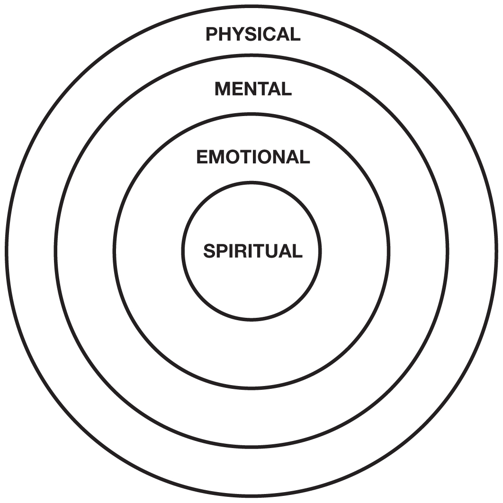
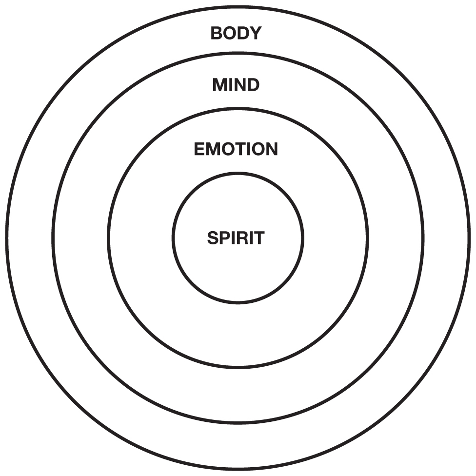
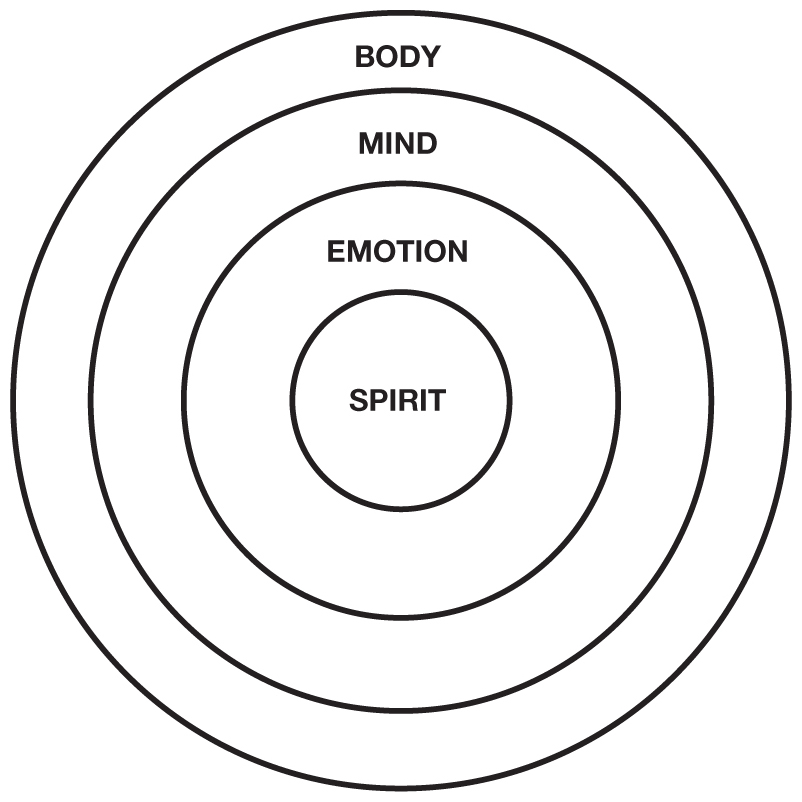

_**Preface**_

WHAT IS YOUR LIFE’S GOAL?

“What do you want to be when you grow up?” That is a question most of us have been asked.

I had many interests as a kid, and it was easy to choose. If it sounded exciting and glamorous, I wanted to do it. I wanted to be a marine biologist, an astronaut, a Marine, a ship’s officer, a pilot, and a professional football player.

I was fortunate enough to achieve three of those goals: a Marine Corps officer, a ship’s officer, and a pilot.

I knew I did not want to become a teacher, a writer, or an accountant. I did not want to be a teacher because I did not like school. I did not want to be a writer because I failed English twice. And I dropped out of my MBA program because I could not stand accounting.

Ironically, now that I have grown up, I have become everything I never wanted to become. Although I disliked school, today I own an education company. I personally teach around the world because I love teaching. Although I failed English twice because I could not write, today I am best known as an author. My book, _Rich Dad Poor Dad_ , was on the _New York Times_ best-sellers list for over seven years and is one of the top three best-selling books in the United States. The only books ahead of it are _The Joy of Sex_ and _The Road Less Traveled_. Adding one more irony, _Rich Dad Poor Dad_ and my _CASHFLOW_ ® board game are a book and a game about accounting, another subject I struggled with.

So what does this have to do with the question: “What is your goal in life?”

The answer is found in the simple, yet profound, statement by a Vietnamese monk, Thich Naht Hahn: “The path is the goal.” In other words, finding your path in life is your goal in life. Your path is not your profession, how much money you make, your title, or your successes and failures.

Finding your path means finding out what you were put here on this earth to do. What is your life’s purpose? Why were you given this gift called life? And what is the gift you give back to life?

Looking back, I know going to school was not about finding my life’s path. I spent four years in military school, studying and training to be a ship’s officer. If I had made a career sailing for Standard Oil on their oil tankers, I would never have found my life’s path. If I had stayed in the Marines or had gone to fly for the airlines, I would never have found my life’s path.

Had I continued on as a ship’s officer or become an airline pilot, I would never have become an international best-selling author, been a guest on the _Oprah_ show, written a book with Donald Trump, or started an international education company that teaches entrepreneurship and investing throughout the world.

_**Finding Your Path**_

This _CASHFLOW Quadrant_ book is important because it is about finding your path in life. As you know, most people are programmed early in life to “Go to school and get a job.” School is about finding a job in the E or S quadrant. It is not about finding your life’s path.

I realize there are people who know exactly what they are going to do early in life. They grow up knowing they are going to be a doctor, lawyer, musician, golfer or actor. We have all heard about child prodigies, kids with exceptional talents. Yet you may notice, these are professions, not necessarily a life’s path.

_**So How Does One Find Their Path in Life?**_

My answer is: I wish I knew. If I could wave my magic wand and your life’s path would magically appear, I would.

Since I do not have a magic wand nor can I tell you what to do, the best thing I can do is tell you what I did. And what I did was trust my intuition, my heart, and my guts. For example, in 1973, returning from the war, when my poor dad suggested I go back to school, get my higher degrees, and work for the government, my brain went numb, my heart went heavy and my gut said, “No way.”

When he suggested I get my old job back with Standard Oil or fly for the airlines, again my mind, heart, and gut said no. I knew I was through sailing and flying, although they were great professions and the pay was pretty good.

In 1973 at the age of 26, I was growing up. I had followed my parent’s advice and gone to school, received my college degree, and had two professions: a license to be a ship’s officer and a license to fly. The problem was, they were professions and the dreams of a child.

At the age of 26, I was old enough to know that education is a process. For example, when I wanted to be a ship’s officer, I went to a school that turned out ships’ officers. And when I wanted to learn to fly, I went to Navy flight school, a two-year process that turns non-pilots into pilots. I was cautious about my next educational process. I wanted to know what I was going to become before I started my next educational process.

Traditional schools had been good to me. I had achieved my childhood professions. Reaching adulthood was confusing because there were no signs saying, “This is the way.” I knew what I _didn’t_ want to do, but I did not know what I _wanted_ to do.

It would have been simple if all I wanted was a new profession. If I had wanted to be a medical doctor, I would have gone to medical school. If I had wanted to be a lawyer, I would have gone to law school. But I knew there was more to life than just going to school to gain another professional credential.

I did not realize it at the time, but at 26 years of age, I was now looking for my path in life, not my next profession.

_**A Different Education**_

In 1973, in my last year of active duty flying for the Marine Corps when I was stationed near home in Hawaii, I knew I wanted to follow in my rich dad’s footsteps. While in the Marines, I signed up for real estate courses and business courses on the weekends, preparing to become an entrepreneur in the B and I quadrants.

At the same time, upon a friend’s recommendation of a friend, I signed up for a personal-development course, hoping to find out who I really was. A personal-development course is non-traditional education because I was not taking it for credits or grades. I did not know what I was going to learn, as I did when I signed up for real estate courses. All I knew was that it was time to take courses to find out about me.

In my first weekend course, the instructor drew this simple diagram on the flip chart:

With the diagram complete, the instructor turned and said, “To develop into a whole human being, we need mental, physical, emotional, and spiritual education.”

Listening to her explanation, it was clear to me that traditional schools were primarily about developing students mentally. That is why so many students who do well in school, do not do well in real life, especially in the world of money.

As the course progressed over the weekend, I discovered why I disliked school. I realized that I loved learning, but hated school.

Traditional education was a great environment for the “A” students, but it was not the environment for me. Traditional education was crushing my spirit, trying to motivate me with the emotion of fear: the fear of making mistakes, the fear of failing, and the fear of not getting a job. They were programming me to be an employee in the E or S quadrant. I realized that traditional education is not the place for a person who wants to be an entrepreneur in the B and I quadrants.

This may be why so many entrepreneurs never finish school—entrepreneurs like Thomas Edison, founder of General Electric; Henry Ford, founder of Ford Motor Company; Steve Jobs, founder of Apple; Bill Gates, founder of Microsoft; Walt Disney, founder of Disneyland; and Mark Zuckerberg, founder of Facebook.

As the day went on and the instructor went deeper and deeper into these four types of personal development, I realized I had spent most of my life in very harsh educational environments. After four years at an all-male military academy and five years as a Marine pilot, I was pretty strong mentally and physically. As a Marine pilot, I was strong emotionally and spiritually, but all on the macho-male development side. I had no gentle side, no female energy. After all, I was trained to be Marine Corps officer, emotionally calm under pressure, prepared to kill, and spiritually prepared to die for my country.

If you ever saw the movie _Top Gun_ starring Tom Cruise, you get a glimpse into the masculine world and bravado of military pilots. I loved that world. I was good in that world. It was a modern-day world of knights and warriors. It was not a world for wimps.

In the seminar, I went into my emotions and briefly touched my spirit. I cried a lot because I had a lot to cry about. I had done and seen things no one should ever be asked to do. During the seminar, I hugged a man, something I had never done before, not even with my father.

On Sunday night, it was difficult leaving this self-development workshop. The seminar had been a gentle, loving, honest environment. Monday morning was a shock to once again be surrounded by young egotistical pilots, dedicated to flying, killing and dying for country.

After that weekend seminar, I knew it was time to change. I knew developing myself emotionally and spiritually to become a kinder, gentler, and more compassionate person would be the hardest thing I could do. It went against all my years at the military academy and flight school.

I never returned to traditional education again. I had no desire to study for grades, degrees, promotions, or credentials again. From then on, if I did attend a course or school, I went to learn, to become a better person. I was no longer in the paper chase of grades, degrees, and credentials.

Growing up in a family of teachers, your grades, the high school and college you graduated from, and your advanced degrees were everything. Like the medals and ribbons on a Marine pilot’s chest, advanced degrees and brand-name schools were the status and the stripes that educators wore on their sleeves. In their minds, people who did not finish high school were the unwashed, the lost souls of life. Those with master’s degrees looked down on those with only bachelor degrees. Those with a PhD were held in reverence. At the age of 26, I knew I would never return to that world.

_Editor’s Note: In 2009, Robert received an honorary PhD in entrepreneurship from prestigious San Ignacio de Loyola in Lima, Peru. The few other recipients of this award are political leaders, such as the former President of Spain_.

_**Finding My Path**_

I know some of you are now asking: Why is he spending so much time talking about non-traditional education courses?

The reason is, that first personal-development seminar rekindled my love of learning, but not the type of learning that is taught in school. Once that seminar was over, I became a seminar junkie, going from seminar to seminar, finding out more about the connection between _my_ body, _my_ mind, _my_ emotions, and _my_ spirit.

The more I studied, the more curious about traditional education I became. I began to ask questions such as:

• Why do so many kids hate school?

• Why do so few kids like school?

• Why are many highly educated people not successful in the real world?

• Does school prepare you for the real world?

• Why did I hate school but love learning?

• Why are most schoolteachers poor?

• Why do schools teach us little about money?

Those questions led me to become a student of education outside the hallowed walls of the school system. The more I studied, the more I understood why I did not like school and why schools failed to serve most of its students, even the “A” students.

My curiosity touched my spirit, and I became an entrepreneur in education. If not for this curiosity, I might never have become an author and a developer of financial-education games. My spiritual education led me to my path in life.

It seems that our paths in life are not found in our minds. Our path in life is to find out what is in our hearts.

This does not mean a person cannot find their path in traditional education. I am sure many do. I am just saying that I doubt I would have found my path in traditional school.

_**Why Is a Path Important?**_

We all know people who make a lot of money, but hate their work. We also know people who do not make a lot of money and hate their work. And we all know people who just work for money.

A classmate of mine from the Merchant Marine Academy also realized he did not want to spend his life at sea. Rather than sail for the rest of his life, he went to law school after graduation, spending three more years becoming a lawyer and entering private practice in the S quadrant.

He died in his early fifties. He had become a very successful, unhappy lawyer. Like me, he had two professions by the time he was 26. Although he hated being a lawyer, he continued being a lawyer because he had a family, kids, a mortgage, and bills to pay.

A year before he died, I met him at a class reunion in New York. He was a bitter man. “All I do is sweep up behind rich guys like you. They pay me nothing. I hate what I do and who I work for.”

“Why don’t you do something else?” I asked.

“I can’t afford to stop working. My first child is entering college.”

He died of a heart attack before she graduated.

He made a lot of money via his professional training, but he was emotionally angry, spiritually dead, and soon his body followed.

I realize this is an extreme example. Most people do not hate what they do as much as my friend did. Yet it illustrates the problem when a person is trapped in a profession and unable to find their path.

To me, this is the shortcoming of traditional education. Millions of people leave school, only to be trapped in jobs they do not like. They know something is missing in life. Many people are also trapped financially, earning just enough to survive, wanting to earn more but not knowing what to do.

Without awareness of the other quadrants, many people go back to school and look for new professions or pay raises in the E or S quadrant, unaware of the world of the B and I quadrants.

_**My Reason for Becoming a Teacher**_

My primary reason for becoming a teacher in the B quadrant was a desire to provide financial education. I wanted to make this education available to anyone who wanted to learn, regardless of how much money they had or what their grade-point averages were. That is why The Rich Dad Company started with the _CASHFLOW_ game. This game can teach in places I could never go. The beauty of the game is that it was designed to have people teach people. There is no need for an expensive teacher or classroom. The _CASHFLOW_ game is now translated into over sixteen languages, reaching millions of people all over the world.

Today, The Rich Dad Company offers financial-education courses as well as the services of coaches and mentors to support a person’s financial education. Our programs are especially important for anyone wanting to evolve out of the E and S quadrants into the B and I quadrants.

There is no guarantee that everyone will make it to the B and I quadrants, yet they will know how to access those quadrants if they want to.

_**Change Is Not Easy**_

For me, changing quadrants was not easy. It was hard work mentally, but more so emotionally and spiritually. Growing up in a family of highly educated employees in the E quadrant, I carried their values of education, job security, benefits, and a government pension. In many ways, my family values made my transition difficult. I had to shut out their warnings, concerns, and criticisms about becoming an entrepreneur and investor. Some of their values I had to discount were:

• “But you have to have a job.”

• “You’re taking too many risks.”

• “What if you fail?”

• “Just go back to school and get your masters degree.”

• “Become a doctor. They make a lot of money.”

• “The rich are greedy.”

• “Why is money so important to you?”

• “Money won’t make you happy.”

• “Just live below your means.”

• “Play it safe. Don’t go for your dreams.”

_**Diet and Exercise**_

I mention emotional and spiritual development because that is what it takes to make a permanent change in life. For example, it rarely works to tell an overweight person, “Just eat less and exercise more.” Diet and exercise may make sense mentally, but most people who are overweight do not eat because they are hungry. They eat to feed an emptiness in their emotions and their soul. When a person goes on a diet-and-exercise program, they are only working on their mind and their body. Without emotional development and spiritual strength, the overweight person may go on a diet for six months and lose a ton of weight, only to put even more weight back on later.

The same is true for changing quadrants. Saying to yourself, “I’m going to become an entrepreneur in the B quadrant,” is as futile as a chain smoker saying, “Tomorrow I’m going to quit smoking.” Smoking is a physical addiction caused by emotional and spiritual challenges. Without emotional and spiritual support, the smoker will always be a smoker. The same is true for an alcoholic, a sex addict, or a chronic shopper. Most addictions are attempts to find happiness in people’s souls.

This is why my company offers courses for the mind and body, but also coaches and mentors to support the emotional and spiritual transitions.

A few people are able to make the journey alone, but I was not one of them. If not for a coach like my rich dad and the support of my wife Kim, I would not have made it. There were so many times I wanted to quit and give up. If not for Kim and my rich dad, I would have quit.

_**Why “A” Students Fail**_

Looking at the diagram again, it is easy to see why so many “A” students fail in the world of money.

A person may be highly educated mentally, but if they are not educated emotionally, their fear will often stop their body from doing what it must do. That is why so many “A” students get stuck in “analysis paralysis,” studying every little detail, but failing to do anything.

This “analysis paralysis” is caused by our educational system punishing students for making mistakes. If you think about it, “A” students are “A” students simply because they made the fewest mistakes. The problem with that emotional psychosis is that, in the real world, people who take action are the ones who make the most mistakes and learn from them to win in the game of life.

Just look at Presidents Clinton and Bush. Clinton could not admit he had sex and Bush could not recall any mistakes he made during his presidency. Making mistakes is human, but lying about your mistakes is criminal, a criminal act known as perjury.

When criticized for making 1,014 mistakes before creating the electric light bulb, Thomas Edison said, “I did not fail 1,014 times. I successfully found out what did not work 1,014 times.”

In other words, the reason so many people fail to achieve success is because they fail to fail enough times.

Looking at the diagram again,

one of the reasons so many people cling to job security is because they lack emotional education. They let fear stop them.

One of the best things about military school and the Marine Corps is that these organizations spend a lot of time developing young men and women spiritually, emotionally, mentally, and physically. Although it was a tough education, it was a complete education, preparing us to do a nasty job.

The reason I created the _CASHFLOW_ game is because the game educates the whole person. The game is a better teaching tool than reading or lecture, simply because the game involves the body, mind, emotions, and spirit of the player.

The game is designed for players to make as many mistakes as possible with play money, and then learn from those mistakes. To me, this is a more humane way to learn about money.

_**The Path Is the Goal**_

Today, there are thousands of CASHFLOW clubs all over the world. One reason why CASHFLOW clubs are important is because they are a shelter from the storm, a way station on the path of life. By joining a CASHFLOW club, you get to meet people like you, people who are committed to making changes, not just talking about change.

Unlike school, there is not a requirement of past academic success. All that is asked is a sincere desire to learn and make changes. In the game, you will make a lot of mistakes in different financial situations and will learn from your mistakes, using play money.

CASHFLOW clubs are not for those who want to get rich quick. CASHFLOW clubs are there to support the long-term mental, emotional, spiritual, physical, and financial changes a person needs to go through. We all change and evolve at different rates of speed so you are encouraged to go at your own speed.

After playing the game with others a few times, you will have a better idea of what your next step should be and which of the four asset classes (business, real estate, paper assets, or commodities) is best for you.

_**In Conclusion**_

Finding one’s path is not necessarily easy. Even today, I do not really know if I am on my path or not. As you know, we all get lost at times, and it is not always easy to find our way back.

If you feel you are not in the right quadrant for you, or you are not on your life’s path, I encourage you to search your heart and find your path in life. You may know it is time to change if you are saying things like the following statements:

• “I’m working with dead people.”

• “I love what I do, but I wish I could make more money.”

• “I can’t wait for the weekend.”

• “I want to do my own thing.”

• “Is it quitting time yet?”

My sister is a Buddhist nun. Her path is to support the Dalai Lama, a path that pays nothing. Yet, although she earns little, it does not mean she has to be a poor nun. She has her own rental property and investments in gold and silver. Her strength of spirit and her financially educated mind allow her to follow her life’s path without taking a vow of poverty.

In many ways, it was a good thing I was labeled stupid in school. Although emotionally painful, that pain allowed me to find my life’s path as a teacher. And like my sister, the nun, just because I am a teacher does not mean I have to be a poor teacher.

Repeating what Thich Naht Hahn said: “The path is the goal.”
