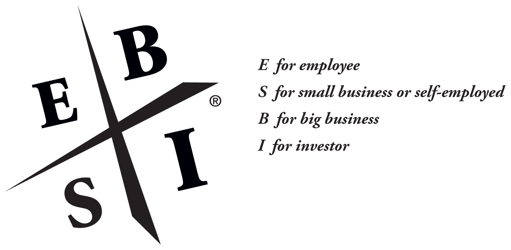
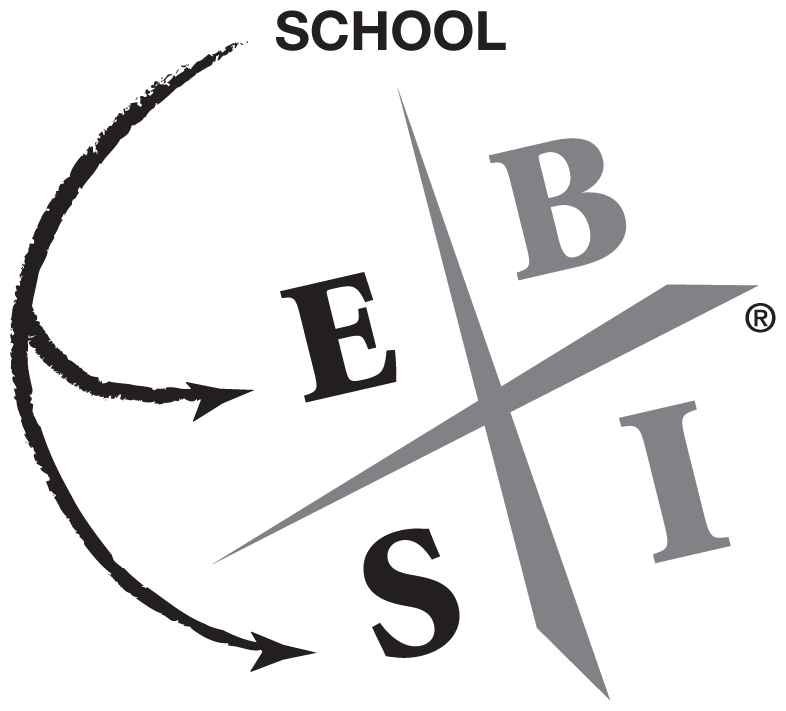
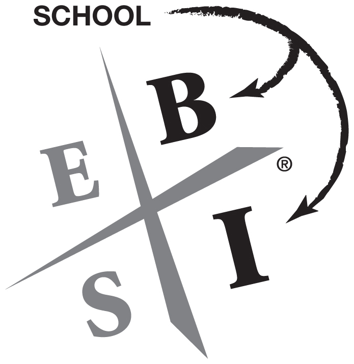

Introduction

WHICH QUADRANT ARE YOU IN?

**_The CASHFLOW Quadrant_ ® _is a way to categorize people based on where their money comes from_.**

Are you financially free? If your life has come to a financial fork in the road, _Rich Dad’s CASHFLOW Quadrant_ was written for you. If you want to take control of what you do today in order to change your financial destiny, this book will help you chart your course.

This is the CASHFLOW Quadrant. The letters in each quadrant represent:

Each of us resides in at least one of the four sections (quadrants) of the CASHFLOW Quadrant. Where we are is determined by where our cash comes from. Many of us are employees who rely on paychecks, while others are self-employed. Employees and self-employed individuals reside on the left side of the CASHFLOW Quadrant. The right side is for individuals who receive their cash from businesses they own or investments they own.

The CASHFLOW Quadrant is an easy way to categorize people based on where their money comes from. Each quadrant within the CASHFLOW Quadrant is unique, and the people within each one share common characteristics. The quadrants will show you where you are today and will help you chart a course for where you want to be in the future as you choose your own path to financial freedom. While financial freedom can be found in all four of the quadrants, the skills of a B or I will help you reach your financial goals more quickly. Successful E’s need to become successful I’s to ensure their financial security during retirement.

_**What Do You Want to Be When You Grow Up?**_

This book is, in many ways, Part II of my book, _Rich Dad Poor Dad_. For those of you who may not have read _Rich Dad Poor Dad_ , it is about the different lessons my two dads taught me about money and life choices. One was my real dad, and the other was my best friend’s dad. One was highly educated and the other was a high school dropout. One was poor, and the other was rich.

_**Poor Dad’s Advice**_

Growing up, my highly educated, but poor, dad always said, “Go to school, get good grades, and find a safe secure job.” He was recommending a life path that looked like this:

Poor dad recommended that I become either a well-paid E, employee, or a well-paid S, self-employed professional, such as a medical doctor, lawyer, or accountant. My poor dad was very concerned about a steady paycheck, benefits, and job security. That’s why he was a well-paid government official, the head of education for the State of Hawaii.

_**Rich Dad’s Advice**_

My uneducated, but rich, dad offered very different advice. He said, “Go to school, graduate, build businesses, and become a successful investor.” He was recommending a life path that looked like this:

This book is about the mental, emotional, and educational process I went through in following my rich dad’s advice.

_**Who Is This Book For?**_

This book is written for people who are ready to change quadrants, especially for individuals who are currently in the E and S categories and are contemplating moving to the B or I category. This book is for people who are ready to move beyond job security and begin to achieve financial security. It’s not an easy life path, but the prize at the end of the road, financial freedom, is worth the journey.

When I was 12 years old, rich dad told me a simple story that guided me to great wealth and financial freedom. It was his way of explaining the difference between the left side of the CASHFLOW Quadrant, the E and S quadrants, and the right side, or the B and I quadrants. The story goes like this:

“Once upon a time there was this quaint little village. It was a great place to live except for one problem. The village had no water unless it rained. To solve this problem once and for all, the village elders asked contractors to submit bids to deliver water to the village on a daily basis. Two people volunteered to take on the task, and the elders awarded the contract to both of them. They felt that a little competition would keep prices low and ensure a backup supply of water.

“The first person who won the contract, Ed, immediately ran out, bought two galvanized steel buckets and began running back and forth to the lake which was a mile away. He immediately began making money as he labored morning to dusk, hauling water from the lake with his two buckets. He would empty them into the large concrete holding tank the village had built. Each morning he had to get up before the rest of the village awoke to make sure there was enough water for the people. It was hard work, but he was very happy to be making money and for having one of the two exclusive contracts for this business.

“The second winning contractor, Bill, disappeared for a while. He wasn’t seen for months, which made Ed very happy, since he had no competition.

“Instead of buying two buckets to compete with Ed, Bill wrote a business plan, created a corporation, found four investors, employed a president to do the work, and returned six months later with a construction crew. Within a year, his team had built a large-volume stainless-steel pipeline which connected the village to the lake.

“At the grand-opening celebration, Bill announced that his water was cleaner than Ed’s water. Bill knew that the villagers had complained about the water’s lack of cleanliness. Bill also announced that he could supply the village with water 24 hours a day, 7 days a week. Ed could only deliver water on weekdays because he didn’t want to work on weekends. Then Bill announced that he would charge 75 percent less than Ed did for this higher-quality, more-reliable water. The villagers cheered and immediately ran for the faucet at the end of Bill’s pipeline.

“In order to compete, Ed immediately lowered his rates by 75 percent, bought two more buckets, added covers to his buckets and began hauling four buckets each trip. In order to provide better service, he hired his two sons to give him a hand on the night shift and on weekends. When his boys went off to college, he said to them, ‘Hurry back because someday this business will belong to you.’

“For some reason, his two sons never returned. Eventually, Ed had employees and union problems. The union demanded higher wages and better benefits and wanted its members to only haul one bucket at a time.

“Meanwhile, Bill realized that if this village needed water, then other villages must need water too. He rewrote his business plan and went off to sell his high-speed, high-volume, low-cost, clean-water delivery system to villages throughout the world. He only makes a penny per bucket of water delivered, but he delivers billions of buckets of water every day. Whether he works or not, billions of people consume billions of buckets of water, and all that money pours into his bank account. Bill developed a pipeline to deliver money to himself, as well as water to the villages.

“Bill lived happily ever after. Ed worked hard for the rest of his life and had financial problems forever after. The end.”

That story about Bill and Ed has guided me for years. It has assisted me in my life’s decision-making process. I often ask myself:

“Am I building a pipeline or hauling buckets?”

“Am I working hard, or am I working smart?”

And the answers to those questions have made me financially free.

That is what this book is about. It’s about what it takes to become a B and an I. It’s for people who are tired of hauling buckets and are ready to build pipelines for cash to flow into their pockets.

_**This Book Is Divided into Three Parts**_

**Part One** The first part of this book focuses on the core differences between people in the four quadrants. It shows why certain people gravitate to certain quadrants and often get stuck there without realizing it. It will help you identify where you are today in the quadrant and where you want to be in five years.

**Part Two** The second part of this book is about personal change. It’s more about who you have to be, instead of what you have to do.

**Part Three** The third part of this book explains how to find success on the right side of the CASHFLOW Quadrant. I will share more of my rich dad’s secrets on the skills required to be a successful B and I. It will help you choose your own path to financial freedom.

Throughout _Rich Dad’s CASHFLOW Quadrant_ , I continue to stress the importance of financial intelligence. If you want to operate on the right side, the B- and I-quadrant side, you must be smarter than if you choose to stay on the left side, the E- and S-quadrant side. To be a B or I, you must be able to control the direction of your cash flow.

This book is written for people who are ready to make changes in their lives to move beyond job security and begin to build their own pipelines to achieve financial freedom.

We are in the Information Age which offers more opportunities for financial reward than ever before. Individuals with the skills of the B’s and I’s will be able to identify and seize those opportunities. To be successful in the Information Age, a person needs information from all four quadrants. Unfortunately, our schools are still in the Industrial Age and still prepare students for only the left side of the CASHFLOW Quadrant.

If you’re looking for new answers to move forward in the Information Age, this book is for you. It doesn’t have all the answers, but it will share the deep personal and guiding insights I gained as I traveled from the E and S side to the B and I side.
